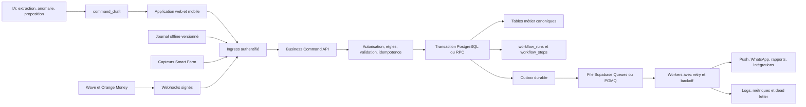

# Horizon Farm ERP

## Stratégie de mise en place de l'automatisation

**Date de l'audit :** 19 juillet 2026
**Référence auditée :** `c20f2c53783d8d65f08b7e2005f73c37f02fabc3` (`origin/main`)
**Périmètre :** application React, API Vercel, schéma et migrations Supabase, finance, trésorerie, paiements, alertes, tâches, notifications, offline et Hey Horizon
**Positionnement :** audit de conseil senior et stratégie d'exécution, sans modification des opérations métier pendant l'audit

## 1. Décision exécutive

Horizon Farm ne part pas de zéro. L'ERP dispose déjà d'une couverture fonctionnelle large, de 26 événements métier déclarés, de formulaires spécialisés, de règles de cohérence, de clés d'idempotence partielles et d'une base RLS Supabase sérieuse.

Cependant, l'essentiel de ce qui est aujourd'hui appelé « automatisation » est une **interconnexion exécutée dans le navigateur**. Une action utilisateur peut déclencher plusieurs écritures dans plusieurs modules, mais l'exécution n'est généralement ni transactionnelle, ni durable, ni observable, ni rejouable de façon sûre si le navigateur se ferme ou si le réseau se coupe.

**Niveau de maturité actuel estimé : 2/5.**
**Cible recommandée pour le coeur ERP : 4/5.**

La décision recommandée est la suivante :

1. Sécuriser immédiatement les paiements, le rejeu offline et les notifications.
2. Geler la création de nouveaux effets métier directement dans les composants React.
3. Construire une porte d'entrée unique appelée **Business Command API**.
4. Exécuter les invariants métier critiques dans des transactions PostgreSQL.
5. Utiliser une file durable pour les effets asynchrones, avec reprise, journal et file d'échec.
6. Faire de la trésorerie en base la seule source de vérité pour Espèces, Wave, Orange Money et Banque.
7. Faire intervenir l'IA pour comprendre, extraire, détecter et proposer, jamais pour inventer ou contourner les règles métier.
8. Migrer progressivement les 26 événements, en commençant par paiements, ventes, stock et alimentation.

Il ne faut pas essayer d'« automatiser partout » en ajoutant davantage de `useEffect`, de minuteries ou de side effects côté écran. Cela augmenterait les doubles écritures et les écarts. Il faut d'abord installer le moteur commun qui rend chaque automatisation fiable.

## 2. Automatisation, interconnexion et IA

### Interconnexion

Une interconnexion propage une saisie d'un module vers d'autres modules pendant que l'application fonctionne.

Exemple actuel : une vente crée une commande, des lignes, une livraison, une facture, un paiement, une écriture finance et des événements.

### Automatisation fiable

Une automatisation fiable garantit qu'une intention validée sera exécutée :

- une seule fois sur le plan métier ;
- complètement ou pas du tout pour les invariants synchrones ;
- même si l'application est fermée après la saisie ;
- avec un statut consultable ;
- avec une reprise automatique en cas d'erreur temporaire ;
- avec une intervention humaine possible en cas d'échec définitif ;
- avec une preuve de qui a déclenché, validé et modifié l'opération.

### IA

L'IA est un accélérateur de décision et de saisie. Elle peut :

- convertir une phrase, une photo ou un document en brouillon structuré ;
- suggérer une catégorie, une cible, un compte ou une pièce manquante ;
- détecter une anomalie, un doublon probable ou un risque ;
- résumer les causes et proposer une prochaine action ;
- produire une prévision avec niveau de confiance.

Elle ne doit pas :

- confirmer un paiement sans preuve du fournisseur de paiement ;
- modifier seule un solde de trésorerie ;
- inventer un montant, une date, un animal, un lot, un client ou un fournisseur ;
- supprimer une preuve, un mouvement de stock ou un événement d'audit ;
- écrire directement dans plusieurs tables en contournant le workflow canonique.

## 3. Méthode et limites de l'audit

L'audit a porté sur :

- les 26 événements de `src/config/businessInterconnections.config.js` ;
- leur matrice d'implémentation et leurs tests ;
- les workflows vente, paiement, achat, stock, élevage, cultures, équipements, documents et objectifs ;
- `AppContext`, les services CRUD et le rejeu offline ;
- les moteurs d'alertes, de santé ERP, de réparation et Smart Farm ;
- les paramètres d'automatisation ;
- les API mobile money et push ;
- les moteurs de consolidation finance et de trésorerie ;
- la comptabilité et les tables de trésorerie ;
- les deux voies d'exécution Hey Horizon ;
- les migrations d'idempotence et de sécurité par ferme ;
- la joignabilité statique du code et la suite de tests unitaires.

Contrôles exécutés :

- `npm run audit:reachability` : 1 046 fichiers source, 977 joignables, 65 fichiers support, 4 orphelins, 0 import non résolu ;
- test HTTP non destructif de la route push de production ;
- suite complète `npm run test:unit` : 259/259 fichiers valides, 0 échec ;
- `npm run build` : build de production réussi, avec un avertissement non bloquant sur la taille de certains bundles ;
- lecture des migrations et du rapport RLS du 13 juillet 2026.

Les quatre fichiers orphelins signalés sont `HeyHorizonQuickAsk.jsx`, `FinanceHeyHorizonStrip.jsx`, `erpHealthRules.js` et `dashboardHeyHorizon.js`. Ils ne bloquent pas l'automatisation, mais doivent être supprimés ou réintégrés explicitement avant de déclarer l'architecture canonique stabilisée.

Limites :

- aucun paiement réel, aucune mutation destructive et aucun scénario financier réel n'ont été lancés en production ;
- le statut distant des migrations Supabase n'a pas pu être revalidé le 19 juillet, car `SUPABASE_ACCESS_TOKEN` n'était pas présent dans l'environnement d'audit ;
- le rapport existant `docs/audits/SUPABASE_RLS_MATRIX.md` indique 99 tables conformes et 0 anomalie au 13 juillet, mais ce résultat doit être rejoué avant la première mise en production du moteur d'automatisation ;
- la validation complète nécessitera un environnement de préproduction, des comptes Wave et Orange Money de test et des scénarios métier signés par la responsable de ferme.

## 4. Échelle de maturité

| Niveau | Définition | Horizon Farm aujourd'hui |
|---|---|---|
| M0 | Saisie manuelle isolée | Quelques cas résiduels |
| M1 | Calcul ou brouillon assisté | Rapports, recommandations, certaines préparations WhatsApp |
| M2 | Interconnexion exécutée dans le navigateur | Niveau dominant des 26 événements |
| M3 | Workflow serveur durable et idempotent | Non atteint pour les 26 événements |
| M4 | Workflow observable, transactionnel, rejouable et récupérable | Cible coeur ERP |
| M5 | Automatisation adaptative avec IA évaluée et gouvernée | Cible sélective après stabilisation M4 |

### Scorecard

| Capacité | Score actuel | Constat | Cible |
|---|---:|---|---:|
| Couverture fonctionnelle des 26 événements | 4/5 | Écrans et workflows présents, impacts documentés | 5/5 |
| Preuve d'exécution de bout en bout | 2/5 | Les tests prouvent surtout la présence des chemins | 5/5 |
| Atomicité et reprise | 1/5 | Écritures séquentielles, pas d'orchestrateur durable | 5/5 |
| Idempotence | 3/5 | Bonnes clés sur plusieurs tables, couverture incomplète | 5/5 |
| Sécurité par ferme | 3,5/5 | Fondation RLS forte, statut distant à revalider | 5/5 |
| Finance et trésorerie | 2/5 | Consolidation utile, mais deux vérités concurrentes | 5/5 |
| Alertes et planification | 1,5/5 | Plusieurs moteurs client, un cron push seulement | 4/5 |
| Observabilité | 1/5 | Pas de `workflow_runs`, étapes, reprise ou file d'échec | 5/5 |
| Offline | 1/5 | File locale présente, erreur d'identifiant au rejeu | 4/5 |
| Gouvernance IA | 2,5/5 | Garde-fous utiles, deux voies contradictoires | 4/5 |

## 5. Constats prioritaires

### P0. Paiements mobile money non sécurisés et comptés trop tôt

**Preuves :**

- `api/mobile-money/[action].js:6-33` ne vérifie ni session utilisateur, ni permission métier ;
- `lib/server/mobileMoney/status.js:80-101` reçoit les en-têtes mais ne valide aucune signature de webhook ;
- `simulate-confirm` est exposé sans contrôle d'accès ;
- `lib/server/mobileMoney/createLink.js:38-58` crée immédiatement une ligne dans `payments`, alors que son statut n'est que `pending` dans le JSON `notes` ;
- `src/utils/financeConsolidationEngine.js:108-116` inclut tout paiement positif non annulé dans l'encaissement ;
- la finalisation ERP complète dépend du polling dans `MobileMoneyPayPanel`, donc du navigateur ouvert.

**Risque :** faux encaissement, créance réduite à tort, simulation déclenchable sans autorisation, falsification de webhook, incohérence entre fournisseur et ERP.

**Décision :** séparer `payment_intents` et `payments`. Une intention en attente ne touche jamais le cash. Seul un webhook signé ou une vérification serveur du fournisseur crée un paiement confirmé et son mouvement de trésorerie.

### P0. Rejeu offline avec mauvais identifiant

**Preuves :**

- `offlineQueueService` crée un identifiant de file dans `item.id` et conserve l'identifiant métier dans `item.recordId` ;
- `AppContext` rejoue pourtant `update(item.id)` et `remove(item.id)` ;
- la déduplication utilise également `item.id` ;
- le test construit manuellement des items où `id` est déjà l'identifiant métier et ne reproduit donc pas le format réel.

**Risque :** modification ou suppression dirigée vers une ligne inexistante, opérations qui restent en file, doublons d'événements, sentiment trompeur de synchronisation réussie.

**Décision :** journal offline versionné avec `command_id`, `record_id`, `idempotency_key`, `base_version`, `attempt_count` et état de conflit explicite.

### P0. Notification immédiate cassée en production

**Preuves :**

- la migration Supabase appelle `/api/push/send-alert` ;
- le fichier serveur existe mais `api/push/[action].js` ne déclare pas l'action `send-alert` ;
- le test de production du 19 juillet retourne `404` et `Unknown push action` ;
- les routes `send-alert` et `dispatch-alerts` autorisent tout appel si `CRON_SECRET` est absent ;
- `latest-alert` fabrique une urgence générique si Supabase est indisponible ;
- plusieurs erreurs sont renvoyées en HTTP 200, ce qui empêche la supervision de distinguer succès et échec.

**Risque :** alertes importantes jamais envoyées, appels non autorisés si la configuration est incomplète, fausses urgences, supervision aveugle.

**Décision :** aligner trigger et route, exiger le secret en toutes circonstances, supprimer les fausses alertes de secours et retourner des codes d'échec réels.

### P0. Workflows multi-modules non atomiques

`commitCommercialSale`, `commitStockPurchaseWorkflow` et `recordSalePayment` enchaînent plusieurs handlers côté client. Une erreur après les premières écritures peut laisser une commande sans facture, un stock sans mouvement, un paiement sans finance ou une finance sans mise à jour client.

L'idempotence réduit certains doublons, mais elle ne garantit ni l'atomicité, ni le rollback, ni la reprise.

**Décision :** les invariants synchrones sont exécutés dans une seule transaction PostgreSQL ou RPC. Les effets externes sont placés dans un outbox au sein de la même transaction.

### P1. Dégradation silencieuse du schéma

`baseSupabaseService.runMutationWithSchemaRetry` peut supprimer jusqu'à 40 colonnes absentes du payload et considérer ensuite l'opération comme réussie. Une colonne critique comme le compte de trésorerie, la preuve, le statut, la clé d'idempotence ou la source peut donc disparaître silencieusement.

**Décision :** échec fermé pour les champs critiques. La compatibilité temporaire doit utiliser une petite allowlist de colonnes non critiques et générer une alerte technique mesurable.

### P1. Plusieurs moteurs concurrents d'alertes et de réparation

Les règles sont réparties entre `unifiedAlerts`, `AlertesCenter`, `erpHealthEngine`, `erpHealthAutoActions`, `ErpInterconnectionBridge`, `erpInterconnectionEngine`, `smartFarmAlertSync` et `smartFarmAlertEngine`.

Le registre interne `canonicalExecutionRegistry` documente lui-même des chemins legacy, parallèles et des doublons d'événements. Le résultat est difficile à prévoir et à administrer.

**Décision :** un seul moteur de règles, un seul registre d'automatisations, un seul mécanisme de déduplication et un seul journal d'exécution. Les moteurs historiques passent d'abord en mode observation, puis sont retirés après comparaison.

### P1. Déclencheurs dépendants de l'écran ouvert

- le moteur ERP Health fonctionne avec `setTimeout` et `setInterval` dans le navigateur ;
- la réparation d'interconnexions démarre cinq secondes après le montage du bridge ;
- les alertes Smart Farm sont synchronisées dans un hook React ;
- les objectifs créent tâches, alertes et événements quand le module Objectifs est monté ;
- « Programmer tâche » dans Rapports crée seulement une tâche, pas une planification de génération.

**Risque :** l'ERP ne réagit pas si personne n'ouvre le bon écran, et deux appareils peuvent exécuter la même règle.

**Décision :** déplacer planifications, règles et réparations vers le serveur. Le navigateur affiche l'état et demande les commandes, il ne joue plus le rôle de worker.

### P1. Paramètres d'automatisation partiellement décoratifs

Les paramètres proposent relances, confirmations, rapports, promotions et tâches critiques. Dans le code, seul le réglage des tâches critiques gouverne réellement un chemin principal. Les autres moteurs ne consultent pas un registre central.

**Décision :** chaque exécution doit référencer une `automation_rule` active, sa version, son périmètre de ferme, ses seuils, son niveau d'approbation et son propriétaire métier.

### P1. Deux sources de vérité de trésorerie

Le module Finance calcule les comptes à partir des moyens de paiement et conserve les soldes réels Wave, Orange Money et caisse dans `localStorage`. Le module Comptabilité lit déjà `treasury_accounts` et `treasury_movements` en base, mais ne crée pas de mouvements. Les tables existent donc sans être la source de vérité opérationnelle.

**Risque :** deux appareils peuvent afficher des soldes réels différents, un retrait n'est pas représenté comme transfert, les ajustements ne sont pas justifiés et la comptabilité peut diverger de Finance.

**Décision :** le ledger de trésorerie en base devient canonique. Aucun solde métier n'est écrasé manuellement. Les corrections passent par des mouvements d'ajustement approuvés et documentés.

### P1. Deux voies Hey Horizon contradictoires

La passerelle client impose un brouillon, un niveau de confiance et un workflow autorisé, ce qui est une bonne direction. Mais elle refuse les handlers CRUD dont plusieurs workflows actuels ont besoin, et ses tests ne couvrent pas une exécution réelle multi-modules réussie.

La voie serveur `/assistant/validate` peut, après confirmation, insérer directement dans une liste de tables avec le JWT utilisateur. Une vente ne crée alors qu'une commande et un achat stock peut créer stock et finance séquentiellement sans mouvement, CMUP ou transaction globale.

**Décision :** fusionner les deux voies. L'IA produit un `command_draft`; après validation humaine et politique de risque, la même Business Command API déterministe exécute l'opération.

### P2. Le statut « COMPLET » des 26 événements est trop optimiste

La matrice interne marque les 26 lignes `COMPLET`. Le test associé vérifie surtout que les fichiers existent, qu'une chaîne de caractères est présente, que les descriptions d'impacts ne sont pas vides et que le statut codé en dur vaut `COMPLET`.

Les tests opérationnels profonds couvrent seulement un sous-ensemble. Cette matrice prouve une couverture de conception, pas l'exécution atomique, durable et observable en production.

**Décision :** remplacer `COMPLET` par des preuves graduées : formulaire, validation, transaction, idempotence, autorisation, reprise, observabilité et test de bout en bout.

## 6. Revue des 26 événements métier

Légende d'approbation :

- **A** : exécution automatique sans approbation, car l'effet est réversible ou informatif ;
- **B** : exécution automatique avec revue ou confirmation légère ;
- **C** : commande humaine explicite obligatoire, puis effets secondaires automatiques ;
- **D** : action interdite à une IA autonome.

| # | Événement | Source | Niveau actuel | Cible automatisée | Approbation | Vague |
|---:|---|---|---|---|:---:|:---:|
| 1 | `feed_reception` | Achats & Stock | M2 client | Réception, CMUP, mouvement, dette ou paiement, preuve, coût de référence dans une transaction | C | 3 |
| 2 | `feed_distribution` | Élevage | M2 client | Sortie stock, coût lot ou animal, indice, alerte seuil et journal atomiques | C | 3 |
| 3 | `broiler_lot_start` | Élevage | M2 client | Lot, coût initial, besoins, échéances vaccin et pesée, projection de vente | C | 4 |
| 4 | `mortality_record` | Élevage | M2 client | Effectif, taux, coût survivant, seuil sanitaire et tâche | C | 4 |
| 5 | `health_treatment` | Élevage | M2 client | Santé, consommation produit, coût, rappel et preuve | C | 4 |
| 6 | `biosecurity_cleaning` | Élevage | M2 client | Nettoyage, matière organique, statut sanitaire, destination et prochaine tâche | C | 4 |
| 7 | `egg_production` | Élevage | M2 client | Production, stock vendable, casse, emballage, taux de ponte | C | 3 |
| 8 | `egg_sale` | Commercial | M2 client | Workflow vente canonique, stock, facture, livraison, paiement ou créance | C | 3 |
| 9 | `broiler_sale` | Commercial | M2 client | Vente canonique, effectif, facture, paiement ou créance, clôture lot | C | 3 |
| 10 | `bovine_weighing` | Élevage | M2 client | Pesée, GMQ, coût/kg, alerte d'écart et prochaine pesée | C | 4 |
| 11 | `bovine_sale` | Commercial | M2 client | Vente canonique, sortie actif, paiement ou créance, marge par tête | C | 3 |
| 12 | `crop_campaign_start` | Cultures | M2 client | Campagne, budget, besoins intrants, irrigation et rendement cible | C | 4 |
| 13 | `irrigation_event` | Cultures | M2 client | Consommation, coût technique, comparaison attendue, alerte fuite | C | 4 |
| 14 | `organic_transfer` | Cultures | M2 client | Sortie organique, affectation parcelle, économie d'intrants, preuve | C | 4 |
| 15 | `crop_harvest` | Cultures | M2 client | Récolte, mouvement stock, pertes, coût/kg et disponibilité commerciale | C | 4 |
| 16 | `crop_sale` | Commercial | M2 client | Vente canonique, stock récolte, paiement ou créance et marge parcelle | C | 3 |
| 17 | `customer_payment` | Commercial | M2 client | Intention, confirmation, mouvement de compte, finance, créance et reçu atomiques | C | 2 |
| 18 | `supplier_payment` | Achats & Stock | M2 client | Dette source, paiement partiel, mouvement de compte, preuve et fournisseur | C | 3 |
| 19 | `equipment_purchase` | Équipements | M2 client | Actif, investissement, compte payé, financement, preuve et maintenance initiale | C | 4 |
| 20 | `equipment_maintenance` | Équipements | M2 client | Intervention, coût si réel, preuve, disponibilité et prochaine échéance | B/C | 4 |
| 21 | `task_lifecycle` | Activité & Suivi | M2 client | Escalade serveur, échéances, preuve de clôture et résolution liée | B/C | 4 |
| 22 | `support_document` | Documents | M2 client | OCR et proposition de rattachement, validation, preuve et taux de complétude | B | 4 |
| 23 | `monthly_financier_report` | Documents | M1 manuel | Génération planifiée sur données arrêtées, validation puis publication versionnée | B | 5 |
| 24 | `funding_usage` | Finance | M2 client | Affectation ligne de financement, mouvement, justificatif, solde et rapport | C | 4 |
| 25 | `growth_objective` | Objectifs | M2 au montage écran | Calcul serveur planifié, scénario, risque, tâche proposée et décision tracée | B | 5 |
| 26 | `smartfarm_signal` | Smart Farm | M2 au montage écran | Ingestion serveur, seuil, alerte et tâche automatique; actionneur sous validation | A/C | 5 |

**Conclusion de la matrice :** 26/26 événements possèdent un chemin fonctionnel ou assisté, mais 0/26 n'atteint aujourd'hui M3 de bout en bout. La priorité n'est donc pas d'ajouter un vingt-septième workflow, mais de rendre les 26 existants fiables progressivement.

## 7. Architecture cible



### Principes structurants

1. **Une intention métier, une commande canonique.** Tous les écrans, imports, assistants et webhooks utilisent la même commande.
2. **Une transaction pour les invariants.** Une vente validée ne peut pas exister à moitié sur commande, stock et créance.
3. **Un outbox pour les effets externes.** La notification peut être retardée sans remettre en cause la transaction métier.
4. **Une file durable pour les traitements asynchrones.** Supabase Queues repose sur PGMQ et fournit livraison garantie, visibilité temporaire et archivage, ce qui correspond au besoin de reprise ([documentation Supabase Queues](https://supabase.com/docs/guides/queues), [PGMQ](https://supabase.com/docs/guides/queues/pgmq)).
5. **Des planifications côté serveur.** Supabase documente l'appel planifié d'Edge Functions avec `pg_cron`, `pg_net` et les secrets dans Vault ([documentation Supabase](https://supabase.com/docs/guides/functions/schedule-functions)).
6. **RLS partout, rôle serveur au strict minimum.** Les tables exposées doivent rester protégées par RLS ([documentation Supabase RLS](https://supabase.com/docs/guides/database/postgres/row-level-security)).
7. **Authentification adaptée au canal.** JWT utilisateur pour les actions utilisateur, secret interne pour les appels service à service, signature du fournisseur pour les webhooks externes ([sécurisation des Edge Functions](https://supabase.com/docs/guides/functions/auth)).
8. **Sécurité fermée par défaut.** Les routes sensibles refusent l'appel si un secret ou une permission manque. Vercel envoie `CRON_SECRET` dans l'en-tête `Authorization` des crons ([documentation Vercel](https://vercel.com/docs/cron-jobs/manage-cron-jobs)).
9. **Autorisation au niveau de chaque fonction sensible.** Une route existante ne suffit pas à prouver le droit d'exécuter son action ([OWASP API5](https://owasp.org/API-Security/editions/2023/en/0xa5-broken-function-level-authorization/)).
10. **Les webhooks de base ne remplacent pas l'orchestration.** Les Database Webhooks Supabase sont asynchrones via `pg_net`; ils conviennent pour réveiller un traitement, mais la transaction et l'outbox restent responsables de la cohérence ([documentation Supabase](https://supabase.com/docs/guides/database/webhooks)).
11. **Un événement d'audit n'est pas une file.** `business_events` reste immuable et lisible. Les commandes, étapes, tentatives et messages ont leurs propres structures.

### Structures recommandées

| Structure | Rôle | Champs essentiels |
|---|---|---|
| `workflow_commands` | Intention validée et contrat d'entrée | `id`, `farm_id`, `type`, `payload`, `actor_id`, `source`, `idempotency_key`, `risk_class` |
| `workflow_runs` | État global d'une exécution | `id`, `command_id`, `status`, `started_at`, `committed_at`, `failed_at`, `error_code`, `attempt_count` |
| `workflow_steps` | Détail et diagnostic par étape | `run_id`, `step_key`, `status`, `input_hash`, `result_refs`, `duration_ms`, `error` |
| `outbox_events` | Effets à publier après commit | `id`, `run_id`, `topic`, `payload`, `available_at`, `published_at` |
| `automation_rules` | Règles administrables et versionnées | `farm_id`, `key`, `version`, `enabled`, `trigger`, `conditions`, `approval_class`, `owner_role` |
| `automation_executions` | Historique des règles | `rule_id`, `run_id`, `outcome`, `reason`, `evaluated_at` |
| `payment_intents` | Demandes mobile money en attente | `provider`, `provider_ref`, `amount`, `status`, `expires_at`, `signature_verified_at` |
| `treasury_reconciliations` | Photo du solde réel | `account_id`, `statement_date`, `erp_balance`, `actual_balance`, `difference`, `evidence_id` |
| `treasury_adjustments` | Correction approuvée, jamais écrasement | `account_id`, `amount`, `reason`, `approved_by`, `evidence_id`, `movement_id` |

Contrainte centrale : `unique(farm_id, workflow_type, idempotency_key)`.

États recommandés :

```text
received -> validated -> executing -> committed -> side_effects_pending -> completed
                                  \-> failed_retryable -> retrying
                                  \-> dead_letter
received -> rejected | cancelled
```

## 8. Modèle financier et trésorerie cible

### Source de vérité

Les comptes `Espèces`, `Wave`, `Orange Money`, `Banque` et les éventuels comptes projet deviennent des lignes de `treasury_accounts`. Leur solde est la somme de mouvements immuables, pas une valeur locale saisie sur un appareil.

Chaque mouvement contient :

- le compte source ou destination ;
- le type `encaissement`, `décaissement`, `transfert`, `retrait`, `dépôt`, `frais`, `ajustement` ;
- l'opération métier source ;
- le moyen de preuve ;
- l'auteur et l'approbateur ;
- la clé d'idempotence ;
- la date métier et la date serveur.

### Cas opérationnels

| Action réelle | Écriture ERP attendue |
|---|---|
| Client paie par Wave | Paiement confirmé + entrée sur compte Wave + diminution créance |
| Client reçoit seulement un lien Wave | `payment_intent=pending`, aucun cash, aucune diminution de créance |
| Retrait Wave vers caisse | Transfert Wave vers Espèces, pas une charge |
| Achat aliment payé en espèces | Charge ou stock + sortie Espèces + pièce justificative |
| Charge ferme payée depuis Orange Money | Charge + sortie Orange Money + catégorie + cible métier + preuve |
| Frais Wave | Charge financière + sortie Wave |
| Argent personnel injecté dans la ferme | Entrée de financement ou compte courant, pas du chiffre d'affaires |
| Solde réel différent du solde ERP | Rapprochement, explication, puis ajustement approuvé si nécessaire |

Avec ce modèle, tout retrait ou paiement destiné à la ferme est traçable. L'utilisateur choisit le compte lors de la charge, du paiement ou du transfert. L'ERP peut alors expliquer chaque écart au lieu de simplement afficher un solde manuel différent.

### Paiement mobile money

Cycle cible :

```text
created -> link_sent -> pending -> confirmed -> posted
                              \-> failed
                              \-> expired
confirmed -> reversed (avec mouvement inverse)
```

Règles :

- `provider_ref` unique ;
- signature vérifiée avant `confirmed` ;
- montant, devise, commande et ferme comparés à l'intention ;
- finalisation serveur idempotente ;
- aucune dépendance au navigateur ;
- remboursement ou annulation par mouvement inverse ;
- rapprochement quotidien des références fournisseur et ERP.

## 9. Catalogue d'automatisations prioritaire

| Priorité | Déclencheur | Effets automatiques | Contrôle humain | Valeur |
|---|---|---|---|---|
| 1 | Paiement client confirmé | Paiement, trésorerie, créance, finance, reçu, statut client | Validation du paiement par preuve fournisseur ou saisie autorisée | Évite les faux soldes et les doubles encaissements |
| 2 | Réception d'aliment | Stock, CMUP, mouvement, dette ou paiement, preuve, coût lot | Validation du bon de réception | Réduit écarts de stock et de marge |
| 3 | Distribution d'aliment | Sortie stock, imputation lot, indice et alerte seuil | Confirmation quantité et cible | Fiabilise le premier poste de coût élevage |
| 4 | Vente validée | Commande, source, livraison, facture, créance ou paiement | Validation prix, quantité, client et compte | Ferme la boucle production vers cash |
| 5 | Échéance ou seuil critique | Alerte dédupliquée, tâche assignée, escalade | Seuils approuvés par le métier | Évite que les alertes restent informatives |
| 6 | Fin de période | Brouillon de rapport arrêté et versionné | Revue finance avant publication | Rend le reporting financeur reproductible |
| 7 | Document reçu | OCR, extraction et proposition de rattachement | Validation si confiance insuffisante | Réduit la ressaisie sans sacrifier la preuve |
| 8 | Signal Smart Farm | Évaluation, alerte, tâche et journal | Action physique sensible confirmée | Transforme la donnée capteur en action |

## 10. Stratégie IA

### Cas à lancer après la fondation

1. **OCR de justificatifs** : fournisseur, date, montant, taxe, mode de paiement, référence et lignes proposées.
2. **Saisie vocale terrain** : transformation en formulaire prérempli, jamais en écriture opaque.
3. **Rapprochement assisté** : proposition de correspondance entre paiement, commande, preuve et mouvement.
4. **Détection d'anomalies** : consommation aliment, mortalité, ponte, prix fournisseur, eau, délais de paiement.
5. **Résumé décisionnel** : causes probables, données manquantes et actions classées par impact.
6. **Prévisions** : besoins d'aliment, trésorerie à 30 jours, date de vente et risque de rupture, avec intervalle et hypothèses visibles.

### Politique de décision

| Classe | Exemple | Rôle IA | Exécution |
|---|---|---|---|
| A | Détecter un capteur hors ligne | Classifie et explique | Alerte automatique |
| B | Rattacher une facture probable | Propose avec score | Validation rapide |
| C | Payer une dette, vendre un animal, ajuster un stock | Préremplit seulement | Confirmation explicite et workflow déterministe |
| D | Modifier un solde ou confirmer un paiement sans preuve | Aucun | Interdit |

### Évaluation obligatoire

Chaque fonctionnalité IA doit disposer d'un jeu de cas réel anonymisé et mesurer :

- précision d'extraction par champ ;
- taux de brouillons acceptés sans correction ;
- taux de correction par champ ;
- faux positifs et faux négatifs des alertes ;
- refus correct quand l'information manque ;
- absence d'écriture avant confirmation ;
- absence de fuite entre fermes.

## 11. Feuille de route

### Vague 0 : sécurisation, 1 à 2 semaines

- corriger `recordId` dans le rejeu offline et ajouter un test construit via la vraie fonction d'enqueue ;
- protéger toutes les routes mobile money et vérifier les signatures ;
- séparer immédiatement intention et paiement confirmé ;
- finaliser le paiement côté serveur ;
- aligner la route push et le trigger, appliquer un refus si secret absent ;
- supprimer les urgences factices de fallback ;
- rendre les colonnes financières critiques obligatoires et arrêter leur suppression silencieuse ;
- ajouter un kill switch global des automatisations ;
- placer les moteurs concurrents en mode observation quand ils peuvent écrire deux fois.

**Gate de sortie :** aucun chemin connu ne peut créer de faux cash, cibler le mauvais identifiant offline ou annoncer un push envoyé alors que la route échoue.

### Vague 1 : socle d'orchestration, 2 à 4 semaines

- créer `workflow_commands`, `workflow_runs`, `workflow_steps`, `outbox_events` et `automation_rules` ;
- exposer la Business Command API avec JWT utilisateur et RLS ;
- créer les premières RPC transactionnelles ;
- installer Supabase Queues ou PGMQ et un worker avec retry, backoff et dead letter ;
- centraliser logs, corrélation, métriques et écran d'administration ;
- brancher les réglages sur le registre central.

**Gate de sortie :** un workflow de référence peut être déclenché deux fois sans double effet, interrompu après commit puis repris jusqu'à `completed`.

### Vague 2 : vérité finance et paiement, 3 à 4 semaines

- rendre `treasury_accounts` et `treasury_movements` canoniques ;
- migrer Espèces, Wave, Orange Money et Banque ;
- imposer le compte à chaque encaissement, décaissement, transfert ou retrait ;
- créer rapprochements, ajustements approuvés et preuves ;
- finaliser le cycle `payment_intents` ;
- générer les écritures comptables à partir des mouvements confirmés ;
- supprimer progressivement la vérité métier stockée dans `localStorage`.

**Gate de sortie :** l'écart entre comptes ERP et soldes de contrôle est expliqué ligne par ligne et identique sur tous les appareils.

### Vague 3 : boucles économiques prioritaires, 3 à 4 semaines

- `customer_payment` ;
- `feed_reception` ;
- `feed_distribution` ;
- `supplier_payment` ;
- workflow commercial commun pour `egg_sale`, `broiler_sale`, `bovine_sale` et `crop_sale` ;
- `egg_production`.

**Gate de sortie :** du stock acheté à la vente encaissée, chaque effet possède une référence de commande, une preuve et un `workflow_run` complet.

### Vague 4 : opérations terrain, 3 à 4 semaines

- lots, mortalité, santé, biosécurité et pesée ;
- campagnes, irrigation, transferts organiques et récoltes ;
- équipements et maintenance ;
- cycle de tâche, documents et financement.

**Gate de sortie :** les 24 événements transactionnels utilisent la même porte de commande et aucun composant React n'écrit ses effets secondaires en parallèle.

### Vague 5 : planifications et alertes, 2 à 3 semaines

- unifier les moteurs d'alertes ;
- migrer échéances, escalades, relances et rapports vers les workers ;
- exécuter objectifs et règles Smart Farm côté serveur ;
- mesurer pertinence, doublons et délais ;
- retirer les bridges réparateurs après période d'observation.

**Gate de sortie :** le comportement ne dépend plus de l'ouverture d'un module et chaque alerte cite sa règle et son exécution.

### Vague 6 : IA gouvernée, 3 à 5 semaines

- unifier les deux passerelles Hey Horizon ;
- lancer OCR et saisie vocale sur les command drafts ;
- ajouter rapprochement assisté, anomalies et prévisions ;
- mettre en place les jeux d'évaluation, seuils et revue mensuelle ;
- n'autoriser aucune nouvelle capacité IA sans fallback déterministe.

**Gate de sortie :** l'IA ne possède aucun accès d'écriture direct et toutes ses actions validées passent par la Business Command API.

### Durée et équipe

Les vagues peuvent se chevaucher après le socle. Estimation recommandée : **14 à 18 semaines calendaires** avec :

- 2 ingénieurs full-stack à dominante backend et PostgreSQL ;
- 0,5 ETP QA automatisation et métier ;
- 0,3 ETP product owner métier ;
- appui ponctuel sécurité, mobile money et infrastructure.

Pour une seule personne, prévoir plutôt 28 à 36 semaines afin de conserver le même niveau de contrôle.

## 12. Plan des 30 premiers jours

### Semaine 1

- corriger les trois P0 : mobile money, offline, push ;
- définir les champs financiers critiques qui doivent échouer fermés ;
- établir la liste finale des moteurs capables d'écrire ;
- exécuter la matrice RLS distante et sauvegarder la preuve ;
- créer un tableau d'incidents et un kill switch.

### Semaine 2

- valider le contrat `BusinessCommand` ;
- créer les tables d'orchestration et leur RLS ;
- installer la file et un worker minimal ;
- instrumenter un workflow laboratoire sans argent réel.

### Semaine 3

- migrer `customer_payment` et le cycle mobile money en préproduction ;
- brancher les mouvements de trésorerie et le rapprochement ;
- tester doublons, coupures réseau, retries et webhooks hors ordre.

### Semaine 4

- pilote sur une ferme et un petit jeu de données réel ;
- rapprochement quotidien Wave, Orange Money et caisse ;
- revue des incidents avec la responsable métier ;
- décision Go/No-Go avant réception et distribution d'aliment.

## 13. Indicateurs de succès

| Indicateur | Cible |
|---|---:|
| Workflows terminés sans intervention technique | au moins 99,5 % |
| Effets métier en double | moins de 0,1 % |
| Exécutions partielles non résolues | 0 |
| Workflows critiques avec journal complet | 100 % |
| Écart de trésorerie inexpliqué | 0 FCFA |
| Webhook paiement confirmé vers ledger | moins de 60 secondes |
| Rejeu offline réussi sans doublon | plus de 99 % |
| Alertes dupliquées | moins de 1 % |
| Faux positifs d'alertes métier | moins de 10 % après calibration |
| Justificatifs présents sur opérations obligatoires | plus de 95 % |
| Temps moyen de résolution d'un workflow en échec | moins de 4 heures |
| Réduction des saisies manuelles sur les parcours migrés | 40 à 60 % |

## 14. Gouvernance

### Responsabilités

| Rôle | Responsabilité |
|---|---|
| Responsable métier | Valide règles, seuils, classes d'approbation et exceptions |
| Product owner | Priorise, tient le catalogue et accepte les parcours |
| Tech lead | Garantit architecture, atomicité, idempotence et sécurité |
| Responsable finance | Valide comptes, mouvements, rapprochements et écritures |
| QA | Maintient scénarios de panne, reprise, permission et non-régression |
| Support | Traite dead letters et incidents avec procédures documentées |

### Revue mensuelle

- automations activées, désactivées et modifiées ;
- erreurs, retries, dead letters et temps de résolution ;
- doublons évités et opérations partielles ;
- écarts de trésorerie et justificatifs manquants ;
- alertes inutiles ou manquées ;
- propositions IA acceptées, corrigées ou refusées ;
- nouvelles règles soumises à validation métier.

## 15. Critères d'acceptation d'une automatisation

Une fonctionnalité ne doit être appelée « automatisée » que si toutes les réponses suivantes sont oui :

1. Le déclencheur est défini et versionné.
2. Le rôle autorisé et la ferme sont vérifiés.
3. La commande possède une clé d'idempotence.
4. Les invariants synchrones sont atomiques.
5. Les effets asynchrones sont mis en file durable.
6. Le statut est visible dans `workflow_runs`.
7. Les erreurs temporaires sont rejouées automatiquement.
8. Les erreurs définitives arrivent dans une file d'intervention.
9. Les données critiques échouent si une colonne ou une preuve manque.
10. Le résultat est identique avec application ouverte ou fermée.
11. Les tests couvrent succès, doublon, timeout, panne partielle, permission et reprise.
12. Un propriétaire métier a signé les règles et le résultat attendu.

## 16. Ce qu'il faut conserver

La stratégie ne recommande pas une réécriture totale. Les actifs suivants sont utiles et doivent être réemployés :

- la carte officielle des 26 événements ;
- les formulaires spécialisés et leurs validations métier ;
- les builders et workflows purs quand ils séparent correctement préparation et exécution ;
- les clés `event_key`, `idempotency_key`, `dedupe_key` et les identifiants déterministes ;
- l'immutabilité de `business_events` et `stock_movements` ;
- la politique `farm_id` et les fonctions de rôles RLS ;
- les moteurs de consolidation comme base de lecture, après clarification des sources canoniques ;
- les garde-fous de brouillon et de validation Hey Horizon ;
- les tests unitaires existants, complétés par des tests transactionnels et de production contrôlée.

## 17. Prochaine décision

La prochaine étape recommandée n'est pas une nouvelle refonte visuelle ou un nouveau module. C'est un **lot de sécurisation et de fondation** avec quatre livrables signés :

1. correctifs P0 déployés ;
2. contrat Business Command API ;
3. schéma d'orchestration et RLS ;
4. pilote `customer_payment` avec trésorerie Wave, Orange Money et Espèces.

Une fois ce pilote rapproché sans écart pendant deux semaines, Horizon Farm pourra industrialiser les autres événements par vagues sans multiplier les chemins parallèles.
