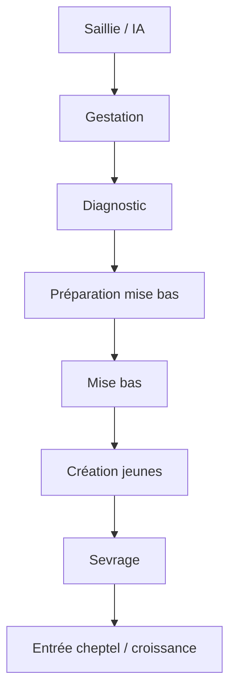

# Audit ultra-détaillé — Onglet Reproduction (Module Élevage)

**Date :** 9 juin 2026  
**Statut :** Document de figement architecture métier — **aucune implémentation, aucune correction code**  
**Périmètre :** Onglet `Reproduction` + dépendances (Animaux, Hey Horizon, schéma ERP, composants orphelins)  
**Méthode :** Revue code, schéma données, UX, cohérence ERP, interconnexions, IA/voix/caméra/mobile  

---

## Score actuel

| Dimension | Score / 100 | Commentaire |
|-----------|-------------|-------------|
| Couverture métier (workflow complet) | 8 | Naissance partielle ; reste absent |
| Boutons & navigation | 35 | 4 boutons ; 2 défaillants ; 2 redondants |
| Formulaires & champs | 12 | Référence canonique non branchée |
| Interconnexions ERP | 25 | Events partiels ; pas pipeline mise bas |
| KPI & digestibilité | 40 | 4 KPI ; 1 faux ; pas de liste terrain |
| IA / Voix / Caméra | 5 | Code alertes orphelin ; zero intent repro |
| Mobile terrain | 45 | Grilles OK ; pas scan ; listener cassé |
| Cohérence design Dashboard V3 | 55 | BusinessHub aligné ; contenu trop vide |
| **Score global pondéré** | **24 / 100** | Centre unique reproduction **non atteint** |

---

## Matrice synthèse (livrable 2)

| Axe | État | Verdict |
|-----|------|---------|
| **Boutons** | 4 actifs + 1 navigation Résumé ; 0 workflow métier | Insuffisant / partiel |
| **Formulaires** | 0 formulaire Reproduction ; 2 formulaires indirects (Hey Horizon, Animaux) | Hors périmètre onglet |
| **Interconnexions** | Naissance → animal ; gestation → event si update | Partiel / manuel |
| **Doublons** | Hub×2, modales×2, naissance multi-entrées | Source de vérité non définie |
| **KPI** | 4 affichés ; 1 faux | À recalculer |
| **IA** | `getReproductionAlerts` non branché ; pas IA repro dans ElevageIaPanel | À spécifier V1 |
| **Voix** | Aucun intent reproduction dans `aiIntentEngine` / `voiceCommands` | Absent |
| **Caméra** | `resolveAnimalScan` existe ; non branché Reproduction | Absent UI |
| **Mobile** | Responsive ; ActionCard sans min-height 44px | Corrections UX V1 |

---

# 1. AUDIT DES BOUTONS

## 1.1 Tableau complet — onglet Reproduction (`ReproductionHub`)

| Bouton | Existe ? | Fonctionne ? | Mène à | Pertinent ? | Bon endroit ? | Doublon ? | Déplacer ? | Supprimer ? | Verdict |
|--------|----------|--------------|--------|-------------|---------------|-----------|------------|-------------|---------|
| **+ Naissance / mise bas** | Oui | **Non** (si tab Animaux non monté) | `emitHorizonForm` → `horizon-open-form` | Oui métier | Oui concept | Oui avec Animaux | Non | **Non** | **Défaillant** — promet mère/portée non livrée |
| **+ Reproduction interne** | Oui | **Non** (idem) | Idem `mode_acquisition: reproduction_interne` | Oui | Oui | Oui Animaux | Non | **Non** | **Défaillant** |
| **Voir femelles reproductrices** | Oui | Oui | `setTab('Animaux')` | Partiel | Acceptable | Avec Historique | Filtrer sur Animaux ou liste ici V1 | Non | **Partiel** |
| **Historique naissances** | Oui | Oui | `setTab('Animaux')` — **identique** | Faible | Non | **Oui** bouton précédent | Fusionner ou journal ici V1 | Non | **Redondant** |

## 1.2 Boutons hors onglet mais liés reproduction

| Bouton | Localisation | Action réelle | Pertinent ? | Verdict |
|--------|--------------|---------------|-------------|---------|
| **Reproduction** (parcours métier) | Résumé Élevage | `setTab('Reproduction')` | Oui | OK navigation |
| **Ajouter Bovin/Ovin** (Cycles) | `ElevageCyclesPanel` | `emitHorizonForm animal_create` | Doublon entrée cheptel | Garder Cycles ; repro distincte |
| **Hey Horizon Quick Ask** | Header Élevage | Assistant générique | Pas repro spécifique | V1 : intents repro |

## 1.3 Composant orphelin `ElevageReproductionPanel`

| Bouton | vs ReproductionHub | Verdict |
|--------|-------------------|---------|
| + Naissance / mise bas | Identique | Orphelin mais **meilleur** (Hey Horizon inline) |
| + Reproduction interne | Identique | Idem |
| Voir femelles | Identique | Idem |
| Historique naissances | **Absent** | Hub a un bouton en plus (redondant) |

**Décision architecture :** ne pas supprimer le Panel — **remplacer** le Hub inline par le Panel en V1 (conservation fonctionnelle + formulaire).

## 1.4 Boutons importants manquants

| Bouton manquant | Priorité métier |
|-----------------|-----------------|
| + Saillie / insémination | P0 |
| + Déclarer gestation | P0 |
| + Diagnostic gestation (écho) | P1 |
| + Mise bas (workflow portée) | P0 |
| + Sevrage | P1 |
| Scanner boucle / QR mère | P1 |
| Voir gestantes / mises bas proches | P0 |
| Généalogie (femelle / portée) | P2 |
| Performances reproductives | P2 (repliable) |

---

# 2. AUDIT DES FORMULAIRES

## 2.1 Inventaire — formulaires touchant la reproduction

| # | Formulaire | Accessible depuis Reproduction ? | Fichier |
|---|------------|----------------------------------|---------|
| F1 | Hey Horizon — création animal | Indirect (listener cassé) | `HeyHorizonAnimalCard.jsx` |
| F2 | Animaux — création | Non (autre onglet) | `AnimauxSpeciesFocused.jsx` `buildCreateFields()` |
| F3 | Animaux — édition | Non | `editFields` |
| F4 | Référence canonique (non UI) | Non | `constants.js` MODULE_FORM_FIELDS.animaux |
| F5 | `reproduction_events` | **Absent** | Schéma seul |
| F6 | AnimalDetailsModal — onglet Reproduction | **Orphelin** | Jamais importé |

## 2.2 F1 — Hey Horizon création animal (chemin depuis Reproduction)

| Champ | Type | Obligatoire | Défaut | Héritage auto | Dépendances | Verdict |
|-------|------|-------------|--------|---------------|-------------|---------|
| Espèce | select | Implicite | `Bovin` ou draft | Non | — | OK |
| Nom / repère | text | Non | vide | Non | — | OK |
| Poids kg | number | Non | vide | Non | — | Inutile naissance néonatale souvent |
| Date | date | Non | today | draft `date` | — | OK |
| Note | text | Non | draft | Non | — | OK |
| **mode_acquisition** | — | — | draft ignoré | **Non appliqué** | Naissance/repro | **Manquant critique** |
| **mere_id** | — | — | — | — | Naissance | **Manquant** |
| **pere_id** | — | — | — | — | Repro interne | **Manquant** |
| **portee_id** | — | — | — | — | Portée | **Manquant** |
| **sexe jeune** | — | — | — | — | — | **Manquant** |
| **date_naissance** | — | — | — | — | vs entrée ferme | **Manquant** |

**Dépendances métier non implémentées :**

- Si `mode_acquisition = naissance_ferme` → afficher mère (select femelles F), portée, nombre petits, date naissance.
- Si `mode = insémination` (futur) → semence, technicien, dose — **n'existe nulle part**.
- Si femelle sélectionnée → auto : âge (`calculateAge`), race, localisation, `statut_reproduction`, historique events — **non branché**.

## 2.3 F2 — Création Animaux (`buildCreateFields`)

| Champ | Type | Oblig. | Défaut | showWhen / dépendance |
|-------|------|--------|--------|------------------------|
| id | text | oui | séquentiel espèce | — |
| boucle_numero | text | oui | auto | — |
| qr_code | text | non | = boucle | Scan possible mais **pas UI caméra** |
| name | text | oui | — | — |
| race | text | non | — | Pas filtre espèce |
| sexe | select F/M | oui | F | — |
| date_naissance | date | non | — | Pas required si achat |
| mode_acquisition | select | oui | achat | **3 opts** : achat, naissance_ferme, don — **pas reproduction_interne** |
| origine | text | non | — | — |
| localisation | text | non | — | — |
| date_entree_ferme | date | oui | today | — |
| date_achat | date | non | — | — |
| poids_entree / poids | number | oui | 0 | — |
| date_derniere_pesee | date | oui | today | — |
| poids_cible | number | oui | suggéré IA croissance | `animalDecisionEngine` |
| purchase_cost | number | oui | 0 | Naissance devrait être 0 auto (`enrichAnimalEntryPayload` existe mais **non appelé** par cette UI) |
| prix_vente_estime | number | non | — | — |
| health_status | select | oui | sain | — |
| photo_url | image | non | — | Preuve possible |
| documents_text | textarea | non | — | Preuve texte |
| notes | textarea | non | — | — |

**Champs manquants vs référence F4 :** mere_id, pere_id, portee_id, en_gestation, dates gestation, male_reproducteur_id, statut_reproduction, notes_reproduction.

**Champs inutiles pour naissance depuis Reproduction :** purchase_cost obligatoire, poids_cible vente, pret_vente — hors contexte néonatal.

**Champs dupliqués :** mode_acquisition partiel vs constants ; deux chemins création (Hey Horizon vs modal Animaux).

## 2.4 F4 — MODULE_FORM_FIELDS.animaux (référence ERP, non UI)

Section reproduction (femelle `sexe === 'F') :

| Champ | Type | showWhen |
|-------|------|----------|
| en_gestation | checkbox | sexe F |
| date_debut_gestation | date | F + en_gestation |
| date_prevue_mise_bas | date | F + en_gestation |
| male_reproducteur_id | select | sexe F |
| statut_reproduction | select | sexe F |

Section origine (naissance / repro interne) :

| Champ | showWhen mode_acquisition |
|-------|-------------------------|
| mere_id, pere_id, portee_id | naissance_ferme, reproduction_interne |
| date_naissance | naissance_ferme, reproduction_interne |

**Verdict :** spec ERP **complète en référence** ; **0 % branchée** sur UI active Reproduction/Animaux.

## 2.5 Formulaire cible `reproduction_events` (schéma seul)

| Champ schéma | Type implicite | Obligatoire métier | Calcul auto cible |
|--------------|----------------|-------------------|-------------------|
| femelle_id | ref animal | oui | Scan / voix |
| male_id | ref animal | saillie/IA | — |
| date_saillie | date | saillie | — |
| date_debut_gestation | date | gestation | = saillie + offset espèce |
| date_prevue_mise_bas | date | gestation | **Calcul auto** espèce |
| date_mise_bas_reelle | date | mise bas | — |
| resultat | enum | diagnostic/mise bas | — |
| nombre_petits | number | mise bas | saisie / voix |
| notes | text | non | — |

**Espèce bovin vs ovin vs caprin (cible V1 spec, pas code) :**

| Espèce | Gestation typique | Champs spécifiques cible |
|--------|-------------------|--------------------------|
| Bovin | ~280 j | IA, race, technicien semence |
| Ovin | ~150 j | portée multiple, saison |
| Caprin | ~150 j | idem ovin |

---

# 3. AUDIT DES PREUVES

| Cas métier | Preuve actuelle | Photo ? | PDF ? | Note ? | Recommandation cible |
|------------|-----------------|---------|-------|--------|---------------------|
| **Mise bas** | `documents_text` / `photo_url` sur animal créé | Optionnel | Non | Oui | Photo portée **recommandée** ; certificat si export |
| **Certificat vétérinaire repro** | Absent | — | Scanner ordonnance (Santé) | — | PDF via Documents ; lien event repro |
| **Diagnostic gestation** | Absent | **Recommandé** (écho) | Optionnel rapport véto | Oui | Photo écho ou PDF véto |
| **Insémination** | Absent | Non | Fiche semence | Date + dose | Note + ref semence |
| **Saillie naturelle** | Absent | Non | Non | Oui | Note terrain suffisant V1 |
| **Identification jeune** | boucle/qr texte | Photo animal | Non | — | Photo + scan boucle **recommandé** |
| **Identification mère (scan)** | qr_code champ texte | Non | Non | — | Scan **prioritaire** terrain |
| **Sevrage** | Absent | Optionnel | Non | Oui | Note + date |
| **Gestation déclarée** | Aucune preuve | Non | Non | Event seul | Note optionnelle V1 ; écho P1 |

**Synthèse :** aucune règle de preuve sur l’onglet Reproduction ; pas de garde-fou « preuve obligatoire ». Cible V1 : preuves **contextuelles** (photo mise bas recommandée, pas bloquante ; diagnostic P1).

---

# 4. AUDIT DES INTERCONNEXIONS

Légende : **A** = automatique | **M** = manuel | **—** = absent | **D** = doublon

## 4.1 Animaux

| Flux | Source → Destination | Mode | Verdict |
|------|----------------------|------|---------|
| Naissance depuis hub | Reproduction → Hey Horizon → `animaux.create` | M (si listener OK) | D avec création Animaux |
| Champs repro femelle | animaux ↔ reproduction_events | — | Absent |
| Event naissance | create animal `mode_acquisition` → `business_events` | A (AppContext) | Bypass Hey Horizon |
| Event gestation | update `en_gestation` → `business_events` | A | Pas UI |
| Généalogie | mere_id/pere_id sur fiche | M saisie | Absent UI |
| Mise bas → MAJ mère | — | — | Absent |
| Création N jeunes | — | — | Absent |
| Opportunité vente | wrapCreate → Commercial | A | **Inapproprié** naissance |

## 4.2 Santé

| Flux | Mode | Verdict |
|------|------|---------|
| Vaccin pré-mise bas | — | Absent |
| Diagnostic véto lié gestation | M via Santé générique | Pas lien repro |
| Scanner ordonnance | SantéV6 → intervention | M | Pas routage Reproduction |
| Impact `en_gestation` sur soins | — | Non spécifié |

## 4.3 Alimentation

| Flux | Mode | Verdict |
|------|------|---------|
| Besoin aliment gestante | — | Absent |
| Distribution mère post-mise bas | Alimentation → animal_id | M existant | Pas depuis repro |

## 4.4 Production

| Flux | Mode | Verdict |
|------|------|---------|
| Œufs / ponte | Avicole | Pas doublon |
| Reproduction ruminants | — | Absent ici (correct si hub repro) |

## 4.5 Transformation

| Flux | Mode | Verdict |
|------|------|---------|
| Abattage / réforme femelle | Transformation → Animaux | M | Pas lien gestation |

## 4.6 Commercial

| Flux | Mode | Verdict |
|------|------|---------|
| Opportunité sur création animal | wrapCreate | A | D / risque naissance |
| Vente jeunes | Commercial | M via Animaux | Pas pipeline sevrage |

## 4.7 Finance

| Flux | Mode | Verdict |
|------|------|---------|
| purchase_cost jeune | M saisie | Manuel |
| Valorisation cheptel naissance | — | Absent |
| Coût repro (IA, véto) | Santé → finances | A partiel | Pas agrégé repro |

## 4.8 Documents

| Flux | Mode | Verdict |
|------|------|---------|
| photo_url / documents_text | M sur animal | M | Pas module Documents structuré |
| DocumentScanner | Documents module | M | Types : ordonnance, facture — **pas certificat naissance** |

## 4.9 Assistant ERP / Hey Horizon

| Flux | Mode | Verdict |
|------|------|---------|
| `openHeyHorizonForm` → elevage/animaux | A navigation | Pas tab Reproduction forcé |
| AUTO_OPEN_FORM_TYPES | inclut `animal_creation` | A | Listener Animaux seulement |
| Intents gestation / mise bas | — | Absent aiIntentEngine |

---

# 5. AUDIT DES DOUBLONS — décision source de vérité

| Doublon | Où A | Où B | Décision cible |
|---------|------|------|----------------|
| Hub reproduction UI | `ReproductionHub` inline | `ElevageReproductionPanel` | **Conserver Panel** ; fusionner bouton Historique |
| Naissance saisie | Reproduction hub | Animaux modal / Hey Horizon / Cycles | **Source vérité : Reproduction** (workflow portée) ; Animaux = consultation/édition identité |
| Champs repro femelle | constants.js | animaux row | **Source : animaux** + events ; hub = vue/workflow |
| Events repro | business_events | reproduction_events (vide) | **Source : reproduction_events** pour saillie→mise bas ; business_events = trace agrégée |
| Modale animal | AnimalDetailsModal | AnimalDetailModal (SpeciesFocused) | **Conserver SpeciesFocused** ; migrer onglet repro lecture seule |
| KPI femelles | Reproduction hub | AnimauxEvolution bucket.reproduction | **Calcul unifié** service repro |
| Alertes gestation | animalLifecycle | alertes_center | **Brancher** getReproductionAlerts → hub + alertes |

**Objectif :** une saisie naissance/mise bas **depuis Reproduction** ; Animaux ne duplique pas le workflow (lecture + lien « ouvrir dans Reproduction »).

---

# 6. AUDIT MÉTIER REPRODUCTION

## 6.1 Workflow idéal



## 6.2 Comparaison existant

| Étape | Existant | Rupture |
|-------|----------|---------|
| Saillie / IA | — | **Totale** |
| Gestation | Champ + event si update manuel | **Pas UI** ; pas date auto |
| Diagnostic | — | **Totale** |
| Préparation mise bas | Alertes code non affichées | **Rupture affichage** |
| Mise bas | Bouton → création 1 animal | **Pas portée** ; pas MAJ mère |
| Création jeunes | Hey Horizon 1 entité | **Pas N petits** |
| Sevrage | — | **Totale** |
| Entrée cheptel | Identité Animaux | OK si animal créé |

## 6.3 Traçabilité (`animalLifecycle` + AppContext)

| Step | Implémenté | Visible UI |
|------|------------|------------|
| Acquisition / naissance | `getAcquisitionTraceStep` | Historique Animaux |
| Gestation | `getGestationTraceStep` | Non |
| Mise bas event | — | Non |

---

# 7. AUDIT DES KPI

## 7.1 KPI existants (ReproductionHub)

| KPI | Calcul actuel | Utile ? | Faux ? | Calcul correct ? | Terrain ? | Verdict |
|-----|---------------|---------|--------|------------------|-----------|---------|
| **Femelles** | filter texte sexe/type/espece | Partiel | Risque | Non strict `sexe=F` | Moyen | **À corriger** |
| **Naissances** | regex events naissance/mise bas | Oui | Non | Approximatif | OK | Garder |
| **Événements** | count tous livestockEvents | Faible | Non | Pas filtré repro | Faible | **Repliable ou filtrer** |
| **À suivre** | femelles − naissances | **Non** | **Oui** | **Incorrect** | **Non** | **Supprimer remplacer** |

## 7.2 KPI définitifs proposés (≤ 6 visibles)

| # | KPI visible | Définition |
|---|-------------|------------|
| 1 | Femelles reproductrices | `sexe=F`, actif, statut ∉ {non_reproductrice, infertile} |
| 2 | Gestantes | `en_gestation=true` ou event gestation actif |
| 3 | Mises bas prévues (30 j) | date_prevue_mise_bas dans fenêtre |
| 4 | Naissances (période) | events + jeunes créés période |
| 5 | Alertes reproduction | count getReproductionAlerts |
| 6 | Taux gestation (%) | gestantes / femelles repro — **repliable si préféré** |

**Sections repliables :** IVV, intervalle entre mises bas, mortalité néonatale, performances par race, journal saillies, généalogie.

---

# 8. AUDIT IA

| Cas IA | Entrée | Sortie | Gain utilisateur | Existant | Cible V1 |
|--------|--------|--------|------------------|----------|----------|
| Prédiction mise bas | date_debut_gestation, espèce | date_prevue_mise_bas | Moins d'erreur date | — | **Règles espèce** (280/150 j) |
| Alertes gestation | en_gestation, date_prevue | alertes warning/danger | Anticiper surveillance | Code orphelin | **Brancher affichage** |
| Recommandation insémination | femelles disponibles, calendrier | liste + score | Planifier saillies | — | Liste « disponibles » règles |
| Analyse fertilité | historique events repro | KPI IVV, taux | Pilotage | AnimauxEvolution partiel | Repliable V1 |
| Diagnostic performance | cheptel F, naissances | écart vs objectif BP | Décision investisseur | — | Export rapport V1 light |
| ElevageIaPanel | mortalité, ponte, marge | findings | — | **Pas reproduction** | Ajouter findings repro V1 |

**Ne pas reporter :** V1 spec inclut règles gestation + alertes + liste gestantes (IA légère, pas ML).

---

# 9. AUDIT VOIX

| Commande vocale cible | Action ERP attendue | Existant |
|-----------------------|---------------------|----------|
| « la vache 102 est gestante » | Resolve animal → patch femelle : en_gestation, dates, male si mentionné → event gestation → alerte | **Absent** |
| « la brebis 14 a mis bas deux agneaux » | Resolve mère → workflow mise bas : 2 jeunes, portee_id, MAJ mère | **Absent** |
| « programmer une insémination » | Draft reproduction_event saillie/IA + date + femelle | **Absent** |
| « diagnostic positif brebis 8 » | Event diagnostic + confirmer gestation | **Absent** |
| « sevrer les agneaux portée P-2024-12 » | Event sevrage + dates | **Absent** |

**Pipeline actuel :** `interpretVoiceCommand` / `aiIntentEngine` — **zéro** pattern reproduction.

**Cible V1 :** routing vers formulaire Reproduction pré-rempli (pas exécution silencieuse) + confirmation utilisateur.

---

# 10. AUDIT CAMÉRA

| Usage | Utilité métier | Module | Gain | Existant |
|-------|----------------|--------|------|----------|
| Lecture boucle auriculaire | Identifier mère sans saisie | Reproduction + `resolveAnimalScan` | Rapidité, erreurs ↓ | Service seul |
| Scan QR animal | Idem | Animaux / Repro | Idem | Champ qr_code texte |
| Photo certificat / écho | Preuve diagnostic | Documents / Repro | Conformité | Scanner Santé ordonnance |
| Photo nouveau-né | Traçabilité portée | Reproduction | Identification visuelle | photo_url animal |
| Photo mise bas | Preuve terrain | Reproduction | Audit | Non |

**Cible V1 :** bouton scan sur workflow mise bas / déclaration gestation → ouvre fiche mère.

---

# 11. AUDIT MOBILE TERRAIN

| Critère | État | Correction proposée V1 |
|---------|------|--------------------------|
| Taille boutons | `ActionCard` p-4, pas min-h 44px | `min-h-[48px]` sur cartes action |
| Gants | Zones clic OK sur ElevageActionCard | Idem + espacement |
| Saisie rapide | Hey Horizon 5 champs | Workflow mise bas 3 taps (mère scan, nb, valider) |
| Hors bureau | Pas offline repro | Hors V1 ; note backlog |
| Listener formulaire | Cassé sur Reproduction | **P0** fix V1 |
| Scroll formulaire | Hey Horizon inline Panel | Monter Panel |
| Tab bar Élevage | 11 onglets — Reproduction loin | Raccourci gestantes sur hub |

---

# 12. DESIGN ET DIGESTIBILITÉ

## 12.1 Évaluation

| Critère | Score | Commentaire |
|---------|-------|-------------|
| Surcharge visuelle | Faible | Peu de contenu — **sous-information** |
| Densité | Très faible | 4 stats + 4 cartes |
| Clarté sections | Moyenne | Intro **sur-promet** |
| Cohérence Dashboard V3 | Bonne | `rounded-3xl`, `#d6c3a0`, BusinessHub = Résumé/Alimentation |
| vs Transformation (riche) | Incohérent | Transformation = formulaire + journal |

## 12.2 Architecture idéale (sans code)

```
┌─────────────────────────────────────────────────────────┐
│ 6 KPI max (femelles, gestantes, MB 30j, naissances,      │
│ alertes, taux gestation repliable)                      │
├─────────────────────────────────────────────────────────┤
│ Actions rapides (6 max) : IA, gestation, mise bas,      │
│ scan mère, voir gestantes, journal                      │
├─────────────────────────────────────────────────────────┤
│ Liste prioritaire : gestantes + mises bas < 14 j        │
├─────────────────────────────────────────────────────────┤
│ [Repliable] Performances · Généalogie · Journal saillies│
├─────────────────────────────────────────────────────────┤
│ Hey Horizon / formulaire contextuel (inline)              │
└─────────────────────────────────────────────────────────┘
```

**Principes :** même shell que Résumé V3 ; pas de second module Animaux pour saisir naissance ; lecture Animaux via lien.

---

# Architecture cible validée (livrable 3)

## Rôles modules

| Module | Rôle reproduction |
|--------|-------------------|
| **Reproduction** | Workflows saillie→sevrage ; journal ; KPI ; alertes |
| **Animaux** | Identité, croissance, vente ; **lecture** repro ; lien « Gérer reproduction » |
| **reproduction_events** | Source vérité événements repro |
| **animaux** (champs) | État courant femelle (gestation, statut) |
| **business_events** | Trace agrégée automatique |
| **Santé** | Interventions liées (véto, vaccin) — référence event repro |
| **Finance** | Valorisation naissance ; coûts IA/véto |
| **Documents** | Preuves liées entity repro / portée |
| **Commercial** | Pas auto-opportunité sur naissance |

## Flux mise bas validée (cible)

```
Scan/choix mère → Formulaire portée (N, sexes, poids) → Validation
  → A : N × create animaux (mode naissance_ferme, mere_id, portee_id)
  → A : update mère (en_gestation=false, statut=a_reposer)
  → A : reproduction_events + business_events
  → M : photo portée → Documents
  → A : valorisation finance cheptel (purchase_cost=0 ou règle métier)
```

---

# Plan V1 uniquement (livrable 4)

**Objectif V1 :** rendre l’onglet **utilisable et fiable** sans supprimer aucune fonction existante ; figer la base avant V2 (CRUD `reproduction_events` complet) et V3 (ML, voix directe).

| ID | Action | Type | Non-régression |
|----|--------|------|----------------|
| V1-01 | Remplacer `ReproductionHub` par `ElevageReproductionPanel` + passer `animalProps`, `horizonDraft` | Montage | 4 boutons conservés |
| V1-02 | Listener `horizon-open-form` au niveau `ElevageRecoveredModule` (animaux drafts) | Fix | Animaux listener inchangé |
| V1-03 | Hey Horizon : appliquer `mode_acquisition`, mère/père, date_naissance, sexe jeune | Formulaire | Champs additionnels optionnels |
| V1-04 | Events `naissance`/`reproduction` alignés AppContext (pas `creation_animal` seul) | Data | Ancien event conservé en trace |
| V1-05 | Brancher `getReproductionAlerts` → bandeau + compteur KPI alertes | IA légère | — |
| V1-06 | KPI : femelles strict F ; remplacer « À suivre » par « Gestantes » ; filtrer naissances période | KPI | 4 KPI → 5 max |
| V1-07 | Liste gestantes + mises bas < 14 j (lecture animaux) | UX | — |
| V1-08 | Fusionner boutons « Voir femelles » / « Historique » → + lien journal events filtré | UX | 1 bouton remplace 2 **actions** ; garder 4e carte « Journal naissances » |
| V1-09 | `wrapCreate` : skip opportunité vente si naissance/repro_interne | Commercial | Naissance sans opp auto |
| V1-10 | Prédiction date mise bas : règles espèce sur déclaration gestation (formulaire simple) | IA règles | — |
| V1-11 | Bouton scan mère sur draft naissance ( `resolveAnimalScan` ) | Caméra | Saisie manuelle reste |
| V1-12 | Voix : intents → draft Reproduction pré-rempli (confirmation) | Voix | Pas auto-commit |
| V1-13 | `min-h-[48px]` sur cartes action Reproduction | Mobile | — |
| V1-14 | Tests : mount Reproduction + emitHorizonForm depuis tab Reproduction | QA | elevageV3 étendu |
| V1-15 | Section repliable « Performances » (lecture AnimauxEvolution / events) | Digestibilité | — |

**Hors V1 (explicitement) :** CRUD complet `reproduction_events`, workflow sevrage, généalogie arbre, valorisation finance auto, preuves obligatoires, offline.

**Critères d’acceptation V1 :**

1. Clic « + Naissance » depuis Reproduction ouvre formulaire visible.  
2. Mère peut être scannée ou saisie ; `mode_acquisition` persisté.  
3. Gestantes visibles avec alertes dépassées / proches.  
4. Aucun bouton existant retiré (Historique fusionné en journal, pas supprimé).  
5. Score cible post-V1 : **~48/100** (fondation, pas centre complet).

---

# Annexes

## Fichiers audités

- `src/modules/ElevageRecoveredModule.jsx` — ReproductionHub, data.females, birthLikeEvents  
- `src/modules/elevage/ElevageReproductionPanel.jsx` — orphelin  
- `src/modules/HeyHorizonAnimalCard.jsx`  
- `src/modules/AnimauxV2.jsx` — listener  
- `src/modules/AnimauxSpeciesFocused.jsx` — formulaires  
- `src/utils/constants.js` — MODULE_FORM_FIELDS  
- `src/utils/animalLifecycle.js` — alertes, traçabilité  
- `src/services/erpRealSchema.js` — reproduction_events  
- `src/context/AppContext.jsx` — events  
- `src/services/animalQrScanService.js`  
- `src/services/heyHorizonAssistantService.js`, `aiIntentEngine.js`, `voiceCommands.js`  
- `src/components/AnimalDetailsModal.jsx` — orphelin  

## Documents liés

- `docs/rapports/AUDIT_ONGLET_REPRODUCTION_ELEVAGE_2026-06-09.md` — audit précédent  
- `docs/rapports/AUDIT_ELEVAGE_COMPLET_2026-06-09.md` — contexte module  

---

*Document de figement architecture — validation métier requise avant toute modification code.*
