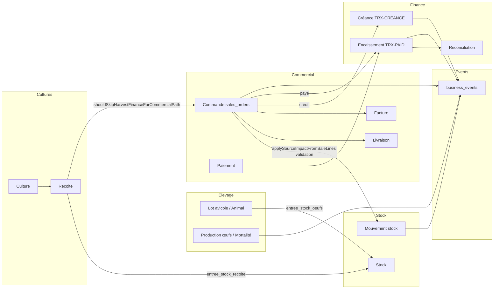

# Horizon Farm — Audit ERP Transversal V1

Date : 2026-06-09  
Branche : `cursor/erp-transversal-audit-v1-ac42`  
Périmètre : **Élevage · Cultures · Stock · Commercial · Finance** via `business_events`, effets de bord finance/stock et chaîne de traçabilité.

**Contrainte respectée** : aucune modification des vérités canoniques (`consolidateFinance`, `buildConsolidatedCommercialKpis`, `summarizeSalesMargins`, `financeIds.receivable`, décrément stock à validation vente).

---

## Score

| Phase | Score /100 | Synthèse |
|-------|------------|----------|
| **Avant correctifs** | **74** | Doublons events possibles ; WhatsApp Terminus message seul ; projection objectifs sans méthode explicite ; relances WhatsApp sans politique d'envoi ; import manquant `resolveCommercialSaleFarmId` (bloquant E2E hors UI ferme) |
| **Après correctifs** | **88** | Garde `findDuplicateBusinessEvent` ; pipeline Terminus → `commitCommercialSale` ; audit transversal `runErpTransversalAudit` ; traçabilité crédit contextualisée ; relances `manual_send_only` |

---

## 1. Matrice des `business_events` (event_type × module_source)

Lecture statique du code + conventions `AppContext.jsx` / workflows. Les compteurs en production dépendent des données terrain ; la matrice décrit **où** chaque type est émis.

| event_type | Élevage (animaux / avicole) | Cultures | Stock | Commercial (ventes) | Finance |
|------------|----------------------------|----------|-------|---------------------|---------|
| `creation_lot` | avicole | — | — | — | — |
| `production_oeufs` | avicole | — | — | — | — |
| `entree_stock_oeufs` | avicole | — | stock | — | — |
| `mortalite` / `mortalite_lot` | avicole, animaux | — | — | — | — |
| `pesee_elevage` | elevage | — | — | — | — |
| `saillie` / `gestation` / `mise_bas` | animaux | — | — | — | — |
| `opportunite_vente_animal` / `avicole` | animaux, avicole | — | — | ventes (cible) | — |
| `culture_creee` | — | cultures | — | — | — |
| `recolte` / `culture_harvest_record` | — | cultures | — | — | — |
| `entree_stock_recolte` | — | cultures | stock | — | — |
| `depense_culture` / `vente_culture` | — | cultures | — | ventes | finances (side) |
| `reception_stock` / `sortie_stock` / `perte_stock` | — | — | stock | — | finances (perte) |
| `stock_mouvement_entree` / `stock_critique_detecte` | — | — | stock | — | — |
| `achat_stock` / `alimentation` | — | — | stock | — | — |
| `vente` / `vente_complete` | animaux | — | — | ventes | — |
| `facture` / `paiement` | — | — | — | ventes | — |
| `opportunite_vente_detectee` / `convertie` | — | — | — | ventes | — |
| `finance_hey_horizon` | — | — | — | — | finances |
| `transfert_inter_fermes` | — | — | stock | — | finances |
| `assistant_validation` | — | — | — | — | assistant |

**Doublons potentiels identifiés (risque, pas vérité canonique)** :

| ID | Description | Sévérité |
|----|-------------|----------|
| EVT-DUP-1 | `recolte` émis par cultures workflow + `AppContext` sur changement statut | Moyenne |
| EVT-DUP-2 | `vente` animal (`AppContext`) vs vente commercial (`commercialSaleWorkflow` businessEvent) si double saisie | Haute |
| EVT-DUP-3 | `paiement` / `facture` auto (`AppContext`) + event workflow vente | Faible (issue_key distinct) |

---

## 2. Diagramme des flux transversaux



Chaîne cible **Lot → Stock → Vente → Livraison → Facture → Créance → Encaissement → Réconciliation** :

1. **Lot** : `source_type lot_avicole` sur commande ou traçabilité `erpInterconnectionEngine`
2. **Stock** : décrément à **validation vente** (`source_impact_applied`, `movementAlreadyExists`)
3. **Vente** : `commitCommercialSale` / `commitSaleWorkflow`
4. **Livraison** : pas de second décrément stock
5. **Facture** : ligne `invoices` + event `facture`
6. **Créance** : `financeIds.receivable(orderId)` idempotent
7. **Encaissement** : `financeIds.paid(orderId, paymentId)` via `recordSalePayment`
8. **Réconciliation** : finance entrée liée `order_id`

---

## 3. Idempotence (garde-fous vérifiés)

| Domaine | Garde | Fichier |
|---------|-------|---------|
| Finance encaissement | `financeIds.paid(orderId, paymentId)` | `saleSideEffects.js` |
| Finance créance | `financeIds.receivable(orderId)` | `saleSideEffects.js` |
| Stock mouvement | `movementAlreadyExists(dedupe_key)` | `stockMovementHelpers.js` |
| Stock ligne vente | `source_impact_applied` par ligne | `saleSideEffects.js` |
| Finance manuelle | `findDuplicateFinanceTransaction` | `financeTransactionMeta.js` |
| business_event | `issue_key` + `findDuplicateBusinessEvent` | `businessEventsService.js` |
| Trace vente | `order_id` + event_type vente dans étapes | `erpInterconnectionEngine.js` |
| Culture → commercial | `shouldSkipHarvestFinanceForCommercialPath` | `cultureSideEffects.js` |

Moteur d'audit : `src/utils/erpTransversalAudit.js` — fonctions `auditBusinessEventDuplicates`, `auditFinanceDuplicates`, `auditStockDoubleExit`, `auditTraceabilityChain`, `runErpTransversalAudit`.

---

## 4. Anomalies détectées

| ID | Anomalie | Sévérité | Statut |
|----|----------|----------|--------|
| A-EVT-1 | Doublons `business_events` si re-commit sans `issue_key` | Moyenne | **Corrigé** (`findDuplicateBusinessEvent` + `skipDuplicate`) |
| A-FIN-1 | Double créance / encaissement si handlers rappelés | Haute | **Mitigé** (garde `financeIds` — inchangé, vérifié) |
| A-STK-1 | Double sortie stock même `dedupe_key` | Haute | **Mitigé** (garde existante — vérifiée) |
| A-WA-1 | Démo Hôtel Terminus : parse seul, pas E2E multi-lignes | Moyenne | **Corrigé** (`whatsappInvestorOrder` + `COMMERCIAL_SALE`) |
| A-WA-2 | `resolveCommercialSaleFarmId` non importé → crash WhatsApp E2E | Haute | **Corrigé** (import `commercialSaleWorkflow.js`) |
| A-PIL-1 | Projection fin de mois sans label méthode | Faible | **Corrigé** (`projectionMethod: linear_no_seasonality`) |
| A-REL-1 | Relances WhatsApp sans politique anti-envoi | Moyenne | **Corrigé** (`COMMERCIAL_RELANCE_WHATSAPP_POLICY`) |
| A-TRACE-1 | Chaîne audit exigeait encaissement sur vente crédit | Faible | **Corrigé** (étapes optionnelles si solde > 0) |
| A-INTER-1 | Animal vendu sans vente (`erpAuditEngine`) | Haute | **Documenté** — repair via Commercial |
| A-INTER-2 | `recolte` double event cultures | Moyenne | **Documenté** — pas de changement canonique |

---

## 5. Correctifs appliqués (cette branche)

| Fichier | Changement |
|---------|------------|
| `src/services/businessEventsService.js` | `findDuplicateBusinessEvent`, `skipDuplicate` dans `createBusinessEvent` |
| `src/utils/erpTransversalAudit.js` | Audit transversal V1 + traçabilité contextualisée |
| `src/services/whatsappHorizon/whatsappInvestorOrder.js` | Parse Terminus → brouillon `COMMERCIAL_SALE` |
| `src/services/whatsappHorizon/whatsappCommandParser.js` | Branche investisseur avant scénarios génériques |
| `src/services/whatsappHorizon/whatsappDraftService.js` | Exécution `commitCommercialSale`, validation `confirmCreateClient` |
| `src/utils/commercialPilotageMetrics.js` | `projectionMethod`, `projectionLinear` |
| `src/utils/commercialRelanceSchedules.js` | `COMMERCIAL_RELANCE_WHATSAPP_POLICY`, `requiresManualSend` |
| `src/utils/commercialSaleWorkflow.js` | Import `resolveCommercialSaleFarmId` (bugfix E2E) |
| `tests/unit/erpTransversalAudit.test.js` | Tests audit |
| `tests/unit/whatsappHorizon.test.js` | Tests Terminus parse + exécution |

---

## 6. Démo Terminus (investisseur)

**Message** : « Bonjour, ici Hôtel Terminus. Je commande 50 plateaux d'œufs et 30 kg de poulets. Facturez-moi, paiement par virement. »

| Étape | Comportement |
|-------|----------------|
| Parse | `isHotelTerminusInvestorOrder` → 2 lignes stock, crédit virement, `a_livrer` |
| Brouillon | `TARGET_WORKFLOWS.COMMERCIAL_SALE`, validation utilisateur obligatoire |
| Exécution | Création client si absent → `prepareCommercialSaleCommit` → `commitCommercialSale` |
| Effets | Stock décrémenté, créance `TRX-CREANCE-{orderId}`, livraison, facture |

---

## 7. Projection & relances

- **Projection fin de mois** : linéaire (`projectionMethod: linear_no_seasonality`) — pas de saisonnalité ; CA source inchangé (`buildMonthlyTargetAttainment`).
- **Relances** : génération auto des plans J+2/J+7/J+15 ; **envoi WhatsApp manuel** (`manual_send_only`, `requiresManualSend: true`).

---

## 8. Vérification

```bash
npx vite-node tests/unit/erpTransversalAudit.test.js
npx vite-node tests/unit/whatsappHorizon.test.js
npm run build
```

---

## 9. Vérités canoniques — non modifiées

- Trésorerie / créances : `consolidateFinance().cashNet`, `creancesReelles`
- CA commercial : `buildConsolidatedCommercialKpis`
- Marge produit : `summarizeSalesMargins`
- Créance : `financeIds.receivable(orderId)`
- Stock : décrément à validation vente, pas à livraison
- Culture commercial : `shouldSkipHarvestFinanceForCommercialPath`

---

*Rapport généré par audit ERP transversal V1 — Horizon Farm.*
