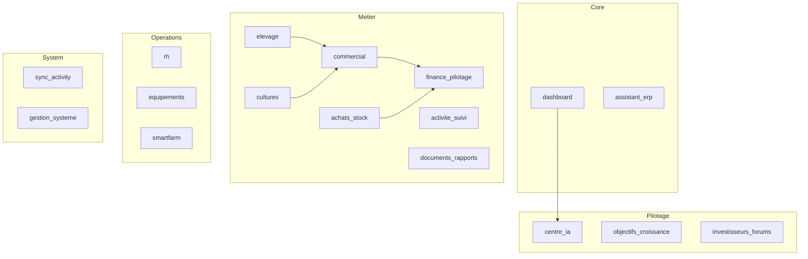
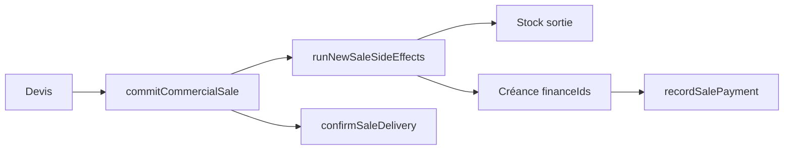

# Horizon Farm — Full ERP Discovery Audit V1

Date : 2026-06-09  
Branche : `cursor/full-erp-discovery-audit-v1-ac42`  
Méthode : scan intégral du dépôt (`src/`, 1117 fichiers source, 539 composants JSX/TSX)  
**Mission lecture seule — aucune modification de code, aucune correction, aucune suppression.**

Objectif : cartographie exhaustive de tout ce qui existe réellement dans l'ERP, y compris hors navigation visible, avant les prochains audits module par module.

---

## Synthèse chiffrée

| Dimension | Volume détecté |
|-----------|----------------|
| Fichiers source `src/` | **1117** |
| Composants JSX/TSX | **539** |
| Routes App (`MODULE_ENTRY_POINTS`) | **35** |
| Modules navigation visible | **17** |
| Modules avancés (route directe) | **18** |
| Workflows `commit*` | **33** |
| `event_type` distincts | **121** |
| Moteurs KPI canoniques / secondaires | **8** familles |
| Surfaces IA | **6** pipelines |
| Rapports d'audit existants | **8** |
| Composants LEGACY (estimation) | **56** |
| Composants ORPHELINS (refs ≤ 1) | **41** |

Sources d'analyse : `src/config/modules.config.js`, `src/config/moduleEntryPoints.js`, `src/App.jsx`, grep statique `event_type`, `commit*Workflow`, imports KPI, arborescence `src/modules/`.

---

## Phase 1 — Inventaire des modules

### 1.1 Modules navigation principale (`NAV_MODULE_ORDER`)

| MODULE | STATUT | POINT D'ENTRÉE | NOMBRE DE COMPOSANTS |
|--------|--------|----------------|----------------------|
| Accueil (`dashboard`) | ACTIF | `DashboardV2.jsx` | 3 (dashboard/) + panels accueil |
| Assistant ERP (`assistant_erp`) | ACTIF | `AssistantERPV2.jsx` | 1 + `AssistantPanel` global |
| Centre décisionnel (`centre_ia`) | ACTIF | `CentreIA.jsx` | 11 (centre/) + 22 (vision/) |
| Objectifs & Croissance (`objectifs_croissance`) | ACTIF | `ObjectifsCroissanceV2.jsx` | 11 (objectifs/) + vision partagée |
| Élevage (`elevage`) | ACTIF | `ElevageModule.jsx` → `ElevageRecoveredModule` | 16 (elevage/) + ~25 bridges racine |
| Commercial (`commercial`) | ACTIF | `CommercialModule.jsx` → `CommercialRecoveredModule` | 30 (commercial/) + VentesV5 embed |
| Achats & Stock (`achats_stock`) | ACTIF | `AchatsStockModule.jsx` | 14 (achatsStock/) + StocksV5 |
| Finance & Pilotage (`finance_pilotage`) | ACTIF | `FinancePilotageModule.jsx` | 21 (finance/) + FinancesV12 onglet |
| Activité & Suivi (`activite_suivi`) | ACTIF | `ActiviteSuiviModule.jsx` | 7 (activiteSuivi/) + alertes/tâches/tracabilité |
| Documents & Rapports (`documents_rapports`) | ACTIF | `DocumentsRapportsModule.jsx` | 5 (documents/) + RapportsV2 |
| Investisseurs & Forums (`investisseurs_forums`) | ACTIF | `InvestisseursForumsModule.jsx` | 4 (investorForums/) + panels investisseur |
| Cultures (`cultures`) | ACTIF | `CulturesRecoveredModule.jsx` | 13 (cultures/) + bridges |
| RH & Équipe (`rh`) | ACTIF | `RHV2.jsx` | RH.jsx + RHUnified + RHPeopleTeams |
| Équipements (`equipements`) | ACTIF | `EquipementsV3.jsx` | bridges maintenance + ressources |
| Smart Farm (`smartfarm`) | ACTIF | `SmartFarm.jsx` | 3 (smartfarm/) |
| Activité & Sync ERP (`sync_activity`) | ACTIF | `SyncActivityCenter.jsx` | 1 (+ audit_logs alias) |
| Gestion du système (`gestion_systeme`) | ACTIF | `GestionSystemeV2.jsx` | panels admin + farms |

### 1.2 Modules avancés — route directe, hors nav (`ADVANCED_MODULE_IDS`)

| MODULE | STATUT | POINT D'ENTRÉE | NOMBRE DE COMPOSANTS |
|--------|--------|----------------|----------------------|
| Animaux (`animaux`) | MASQUÉ → Élevage | `AnimauxV2.jsx` | 1 + modales |
| Avicole (`avicole`) | MASQUÉ → Élevage | `AvicoleV10.jsx` | 1 + bridges avicole |
| Santé (`sante`) | MASQUÉ → Élevage | `SanteV8.jsx` | 3 versions legacy (V6-V8) |
| Finances (`finances`) | MASQUÉ → Finance | `FinancesV12.jsx` | 12 versions historiques V2-V12 |
| Comptabilité (`comptabilite`) | MASQUÉ | `ComptabiliteV7.jsx` | 7 versions V3-V7 |
| Investissements (`investissements`) | MASQUÉ → Finance | `InvestissementsV9.jsx` | panels BP + investissements |
| Stock (`stock`) | MASQUÉ → Achats | `StocksV5.jsx` | 5 versions StocksV2-V5 |
| Clients (`clients`) | MASQUÉ → Commercial | `ClientsReadable.jsx` | Clients + ClientsV2 legacy |
| Fournisseurs (`fournisseurs`) | MASQUÉ → Achats | `FournisseursReadable.jsx` | Fournisseurs + bridges |
| Traçabilité (`tracabilite`) | MASQUÉ → Activité | `TracabiliteV2.jsx` | Tracabilite + TracabiliteV2 |
| Alertes (`alertes`) | MASQUÉ → Activité | `AlertesCenterV3.jsx` | 3 versions centre alertes |
| Ventes (`ventes`) | MASQUÉ → Commercial | `VentesV5.jsx` | VentesV2-V6 legacy + V5 actif |
| Documents (`documents`) | MASQUÉ | `DocumentsV2.jsx` | DocumentsV2 + OCR panel |
| Tâches (`taches`) | MASQUÉ → Activité | `TachesV3.jsx` | TachesV2/V3 |
| Rapports (`rapports`) | MASQUÉ | `RapportsV2.jsx` | Rapports + bridges auto |
| Sync (`sync`) | MASQUÉ | `SyncActivityCenter.jsx` | alias sync_activity |
| Audit logs (`audit_logs`) | ADMIN | `SyncActivityCenter.jsx` | même entry que sync |

### 1.3 Modules supplémentaires détectés (non listés nav)

| MODULE / SURFACE | STATUT | POINT D'ENTRÉE | COMPOSANTS |
|------------------|--------|----------------|------------|
| Hey Horizon (overlay) | ACTIF global | `AssistantPanel` + `HeyHorizonModule` | 8 services heyHorizon* |
| WhatsApp Horizon | ACTIF | `whatsappHorizon/*` | 4 fichiers pipeline |
| AI Gateway | ACTIF | `services/aiGateway/*` | 21 fichiers |
| Horizon Advisor | EXPÉRIMENTAL | `services/horizonAdvisor/*` | advisorDraftService, rules |
| OCR Intelligent | ACTIF | `InvoiceOcrIntelligentPanel` | documentScanner* |
| Operations Ressources | ACTIF interne | `OperationsRessourcesRecoveredModule` | 4 (ressources/) |
| Farms multi-fermes | ADMIN | `farms/*` + GestionSysteme | 2 |
| Simulation / démo | DEBUG | `horizonFarmSimulationScenarios.js` | tests + démo investisseur |
| Impact Business (legacy) | LEGACY alias | `impact_business` → InvestisseursForums | ImpactBusiness* V2-V5 |

### 1.4 Sous-dossiers `src/modules/` (composants par famille)

| Dossier | Fichiers JSX |
|---------|--------------|
| `_root` (modules/*.jsx) | 289 |
| commercial/ | 30 |
| vision/ | 22 |
| finance/ | 21 |
| elevage/ | 16 |
| achatsStock/ | 14 |
| cultures/ | 13 |
| centre/ | 11 |
| objectifs/ | 11 |
| activiteSuivi/ | 7 |
| documents/ | 5 |
| ressources/ | 4 |
| dashboard/ | 3 |
| smartfarm/ | 3 |
| farms/ | 2 |

---

## Phase 2 — Inventaire des routes

Toutes les routes sont définies dans `src/config/moduleEntryPoints.js` → `MODULE_ENTRY_POINTS`.  
Résolution alias : `resolveActiveModuleId` (`impact_business` → `investisseurs_forums`).  
Redirections runtime App.jsx : `ventes`→commercial, `finances`→finance_pilotage, `reconciliation` commercial→finance onglet Réconciliation.

| ROUTE | COMPOSANT | CATÉGORIE | UTILISÉE ? |
|-------|-----------|-----------|------------|
| `dashboard` | DashboardV2.jsx | visible nav | **OUI** |
| `assistant_erp` | AssistantERPV2.jsx | visible nav | **OUI** |
| `centre_ia` | CentreIA.jsx | visible nav | **OUI** |
| `objectifs_croissance` | ObjectifsCroissanceV2.jsx | visible nav | **OUI** |
| `elevage` | ElevageModule.jsx | visible nav | **OUI** |
| `commercial` | CommercialModule.jsx | visible nav | **OUI** |
| `achats_stock` | AchatsStockModule.jsx | visible nav | **OUI** |
| `finance_pilotage` | FinancePilotageModule.jsx | visible nav | **OUI** |
| `activite_suivi` | ActiviteSuiviModule.jsx | visible nav | **OUI** |
| `documents_rapports` | DocumentsRapportsModule.jsx | visible nav | **OUI** |
| `investisseurs_forums` | InvestisseursForumsModule.jsx | visible nav | **OUI** |
| `cultures` | CulturesRecoveredModule.jsx | visible nav | **OUI** |
| `rh` | RHV2.jsx | visible nav | **OUI** |
| `equipements` | EquipementsV3.jsx | visible nav | **OUI** |
| `smartfarm` | SmartFarm.jsx | visible nav | **OUI** |
| `sync_activity` | SyncActivityCenter.jsx | visible nav (system) | **OUI** |
| `gestion_systeme` | GestionSystemeV2.jsx | visible nav (admin) | **OUI** |
| `animaux` | AnimauxV2.jsx | cachée / legacy route | **OUI** (redirect élevage) |
| `avicole` | AvicoleV10.jsx | cachée | **OUI** |
| `sante` | SanteV8.jsx | cachée | **OUI** |
| `finances` | FinancesV12.jsx | cachée | **OUI** |
| `comptabilite` | ComptabiliteV7.jsx | cachée | **OUI** |
| `investissements` | InvestissementsV9.jsx | cachée | **OUI** |
| `impact_business` | InvestisseursForumsModule.jsx | legacy alias | **OUI** (déprécié) |
| `stock` | StocksV5.jsx | cachée | **OUI** |
| `clients` | ClientsReadable.jsx | cachée | **OUI** |
| `fournisseurs` | FournisseursReadable.jsx | cachée | **OUI** |
| `tracabilite` | TracabiliteV2.jsx | cachée | **OUI** |
| `alertes` | AlertesCenterV3.jsx | cachée | **OUI** |
| `ventes` | VentesV5.jsx | legacy route | **OUI** (embed commercial) |
| `documents` | DocumentsV2.jsx | cachée | **OUI** |
| `taches` | TachesV3.jsx | cachée | **OUI** |
| `rapports` | RapportsV2.jsx | cachée | **OUI** |
| `equipements` | EquipementsV3.jsx | visible + route | **OUI** |
| `sync` | SyncActivityCenter.jsx | migration alias | **OUI** |
| `audit_logs` | SyncActivityCenter.jsx | admin | **OUI** |

### Routes interdites comme entry (`FORBIDDEN_ENTRY_FILES`) — **NON utilisées** par App

`Dashboard.jsx`, `ImpactBusiness.jsx`, `ImpactBusinessShell.jsx`, `GestionSysteme.jsx`, `SyncActivityCenterV2.jsx`, `VentesV2.jsx`, `VentesV3.jsx`, `AlertesCenterV2.jsx`, `AlertesCenter.jsx`, `EquipementsV2.jsx`, `CulturesV5.jsx` (alias uniquement).

### Surfaces repair / debug détectées (pas de route dédiée)

| Surface | Fichier | Accès |
|---------|---------|-------|
| Cultures Repair | `cultures/CulturesRepairPanel.jsx` | Onglet Cultures |
| Finance Data Quality | `finance/FinanceDataQualityPanel.jsx` | Finance pilotage |
| Achats Data Quality | `achatsStock/AchatsStockDataQualityPanel.jsx` | Achats & Stock |
| Audit Coverage Matrix | `AuditCoverageMatrixPanel.jsx` | Gestion système |
| Justified Exceptions | `workflow/JustifiedExceptionsAuditPanel.jsx` | Sync / qualité |
| Vision Module Audit | `VisionModuleAuditPanel.jsx` | Centre / vision |
| Correction Deployment | `CorrectionDeploymentStatusPanel.jsx` | orphan — pas monté |

---

## Phase 3 — Inventaire des composants

Scan : **539** fichiers JSX/TSX. Classification heuristique : monté (entry App), refs ≥ 3, FORBIDDEN, version suffix, bridges.

### Répartition par statut

| STATUT | ESTIMATION | CRITÈRE |
|--------|------------|---------|
| **ACTIF** | ~442 | Monté UI ou refs ≥ 3 |
| **LEGACY** | ~56 | V* historiques, FORBIDDEN, remplacés |
| **ORPHELIN** | ~41 | refs ≤ 1, jamais importé |
| **EXPÉRIMENTAL** | ~30 | *Bridge*, *Repair*, *Debug*, démo |

### Échantillon composants ORPHELINS (refs = 0–1)

`CulturesModule`, `DocsRecovered`, `AnimalDetailsModal`, `AppVersionBadge`, `AdminSyncModule`, `AvicoleFinal`, `DecisionRecommendationCardCompact`, `CorrectionDeploymentStatusPanel`, `ImpactBusinessStrategicV2`–`V5`, `ImpactFarmValueBridgeV2`–`V5`.

### Échantillon composants LEGACY (versions multiples)

| Famille | Versions détectées | Canonique actuel |
|---------|-------------------|------------------|
| Finances | V2–V12 | FinancesV12 |
| Ventes | V2–V6 | VentesV5 (embed Commercial) |
| Stocks | V2–V5 | StocksV5 |
| Cultures | V2–V5 | CulturesRecoveredModule |
| Avicole | V4–V10, Final | AvicoleV10 |
| Comptabilité | V3–V7 | ComptabiliteV7 |
| Alertes | Center, V2, V3 | AlertesCenterV3 |
| Dashboard | Dashboard, V2 | DashboardV2 |
| Impact Business | Shell + Strategic V2–V5 | InvestisseursForumsModule |
| Gestion système | GestionSysteme, V2 | GestionSystemeV2 |

### Top composants ACTIFS (par références croisées)

`CommercialRecoveredModule`, `FinancePilotageRecoveredModule`, `ElevageRecoveredModule`, `DashboardV2`, `App.jsx`, `StocksV3/V5`, `CentreIA`, panels `*PilotagePanel`, `*InsightPanel`.

---

## Phase 4 — Inventaire des workflows

33 fonctions `commit*` détectées + hubs `runNewSaleSideEffects`, `recordSalePayment`, `confirmSaleDelivery`, `prepare*`.

### Ventes & Commercial

| WORKFLOW | CANONIQUE ? | LEGACY ? | POINT D'ENTRÉE |
|----------|-------------|----------|----------------|
| `commitCommercialSale` | **OUI** | — | VentesTerrainV3, WhatsApp, AI Gateway |
| `prepareCommercialSaleCommit` | **OUI** (prepare) | — | commercialSaleWorkflow |
| `commitCommercialQuote` | **OUI** | — | CommercialQuotesPanel |
| `recordSalePayment` | **OUI** | — | SaleActionModal, VentesV6, WhatsApp |
| `confirmSaleDelivery` | **OUI** | — | VentesV4, SalesFollowUpPanel |
| `runNewSaleSideEffects` | **OUI** (hub) | — | commercialSale, cultures vente |
| `commitSaleWorkflow` | — | **OUI** | WhatsApp vente simple, VentesV2 |
| `commitCultureStockSale` | **OUI** | — | culturesWorkflow |

### Achats & Stock

| WORKFLOW | CANONIQUE ? | LEGACY ? | POINT D'ENTRÉE |
|----------|-------------|----------|----------------|
| `commitStockPurchaseWorkflow` | **OUI** | — | StocksV3/V5, StockPurchaseReceptionForm |
| `commitPurchaseWorkflow` | — | **OUI** | WhatsApp achat simple |
| `commitFarmTransfer` | **OUI** | — | AchatsStockTransferPanel |
| `commitFeedingWorkflow` | **OUI** | — | StocksV3 alimentation |

### Élevage

| WORKFLOW | CANONIQUE ? | LEGACY ? | POINT D'ENTRÉE |
|----------|-------------|----------|----------------|
| `commitElevageMortality` | **OUI** | — | ElevageWorkflowPanels |
| `commitElevageFeeding` | **OUI** | — | elevageWorkflow |
| `commitElevageHealth` | **OUI** | — | elevageWorkflow |
| `commitElevageEggProduction` | **OUI** | — | Production hub |
| `commitElevageWeighing` | **OUI** | — | fiches animaux |
| `commitElevageTransformation` | partiel | — | elevageWorkflow |
| `commitOfficialTransformation` | **OUI** | — | TransformationOfficialForm |
| `commitHealthWorkflow` | **OUI** | — | workflowService / santé |
| `commitBiosecurityWorkflow` | **OUI** | — | SanteV8 |

### Cultures

| WORKFLOW | CANONIQUE ? | LEGACY ? | POINT D'ENTRÉE |
|----------|-------------|----------|----------------|
| `commitCultureHarvest` | **OUI** | — | CulturesHarvestPanel |
| `commitCultureExpense` | **OUI** | — | intrants |
| `commitCultureTransformation` | **OUI** | — | transformation hub |
| `commitHarvestWorkflow` | partiel | legacy wrapper | workflowService |

### Finance & investissements

| WORKFLOW | CANONIQUE ? | LEGACY ? | POINT D'ENTRÉE |
|----------|-------------|----------|----------------|
| `consolidateFinance` | **OUI** (lecture) | — | Finance, Dashboard, Hey Horizon |
| `commitFinanceReconciliationRepair` | repair | — | FinanceReconciliationPanel |
| `commitInvestmentExecutionWorkflow` | **OUI** | — | InvestissementsV9 |
| `commitRhPayroll` | **OUI** | — | RH workflows |

### Ressources & système

| WORKFLOW | CANONIQUE ? | LEGACY ? | POINT D'ENTRÉE |
|----------|-------------|----------|----------------|
| `commitEquipmentMaintenance` | **OUI** | — | Equipements bridges |
| `commitEquipmentBreakdown` | **OUI** | — | pannes |
| `commitSmartDeviceOffline` | **OUI** | — | Smart Farm |
| `commitDocumentLink` | **OUI** | — | documentsWorkflow |
| `commitAlertActionWorkflow` | **OUI** | — | alertes |
| `commitWithImpactJournal` | meta | — | workflowImpactJournal |

---

## Phase 5 — Inventaire Business Events

**121** `event_type` distincts émis dans le code.

### Matrice synthétique (regroupée par domaine)

| EVENT_TYPE (échantillon) | MODULE | ÉMIS PAR | CONSOMMÉ PAR |
|--------------------------|--------|----------|--------------|
| `vente`, `vente_commercial_workflow`, `vente_complete` | ventes | AppContext, commitCommercialSale, workflowService | Activité suivi, ERP audit, traçabilité |
| `paiement`, `facture`, `livraison_vente` | ventes | AppContext, workflows | Finance réconciliation, Commercial |
| `reception_stock`, `sortie_stock`, `perte_stock` | stock | StocksV3/V4, stockWorkflows | AchatsStock insight, audit stock |
| `stock_mouvement_entree`, `achat_stock` | stock | stockPurchaseWorkflow | consolidateFinance stock |
| `recolte`, `culture_harvest_record`, `vente_culture` | cultures | AppContext, culturesWorkflow | Cultures pilotage, objectifs |
| `mortalite`, `production_oeufs`, `pesee_elevage` | élevage | elevageWorkflow, AppContext | Production hub, diagnostic |
| `gestation`, `saillie`, `mise_bas` | reproduction | ReproductionWorkflowForm | Élevage reproduction |
| `sante`, `vaccination`, `sante_retard_*` | santé | AppContext, SanteV8, healthSideEffects | Élevage santé, alertes |
| `recette`, `depense`, `finance_hey_horizon` | finance | AppContext, FinancesV12 | Finance pilotage, Hey Horizon |
| `assistant_validation`, `tache_hey_horizon` | assistant | heyHorizonAssistantService | Activité suivi |
| `opportunite_vente_detectee`, `opportunite_convertie` | commercial | AppContext, baseSupabaseService | Commercial opportunités |
| `bp_ligne_concretisee`, `bp_charge_concretisee` | BP | bpLineConcretization | Investissements |
| `investissement_realise`, `dossier_financeur_prepare` | investisseur | investmentWorkflows, financeur | Investisseurs forums |
| `smartfarm_offline`, `smartfarm_signal_critique` | smartfarm | ressourcesWorkflow | Smart Farm panel |
| `transfert_inter_fermes` | multi-ferme | farmTransferWorkflow | Achats transfer |

### Liste complète des 121 event_type

`abattage`, `abattage_animal`, `abattage_avicole`, `absence_rh_signalee`, `achat_stock`, `acquisition`, `actif_investissement_cree`, `alerte_ia_auto`, `alerte_resolue`, `alimentation`, `alimentation_plan_applique`, `assistant_priority_task`, `assistant_validation`, `assistant_voice_parse`, `audit_interconnexion_repare`, `autre`, `biosécurité`, `bp_charge_concretisee`, `bp_ligne_concretisee`, `carburant_equipement`, `commande_fournisseur_preparee`, `commande_fournisseur_stock_preparee`, `creation_animal`, `creation_lot`, `croissance`, `culture_creee`, `culture_harvest_record`, `deces`, `decision_action_task_created`, `decision_risk_alert_created`, `depense_culture`, `devis_commercial`, `devis_converti_commande`, `document_ajoute`, `document_lie`, `document_reproduction`, `dossier_financement_genere`, `dossier_financeur_prepare`, `entree_fumier`, `entree_stock_oeufs`, `entree_stock_recolte`, `facture`, `finance_hey_horizon`, `gestation`, `incident`, `intrant_culture_utilise`, `investissement_effectif`, `investissement_realise`, `livraison_vente`, `maintenance_equipement`, `maintenance_equipement_cloturee`, `maintenance_equipement_preparee`, `maintenance_equipement_programmee`, `mise_bas`, `mortalite`, `mortalite_lot`, `mouvement_stock`, `naissance`, `objectif_plan_action`, `opportunite_convertie`, `opportunite_convertie_commande`, `opportunite_vente_animal`, `opportunite_vente_avicole`, `opportunite_vente_detectee`, `owner_salary_validated`, `paiement`, `paiement_fournisseur`, `paiement_hors_erp`, `paiement_remuneration`, `panne_equipement_declaree`, `perte_avicole`, `perte_culturale`, `perte_stock`, `perte_stock_quantite`, `pesee_elevage`, `preuve_impact_demandee`, `priorite_traitee`, `production_oeufs`, `reception_fournisseur_stock`, `reception_stock`, `recolte`, `recolte_culture`, `recolte_culture_disponible`, `relance_client_preparee`, `reparation_equipement_cloturee`, `reproduction`, `revision_marge_culture`, `risque_culture_detecte`, `risque_impact_signale`, `saillie`, `sante`, `sante_cout_synchronise`, `sante_retard_detecte`, `sante_retard_resolu`, `smartfarm_action_creee`, `smartfarm_offline`, `smartfarm_signal_critique`, `soin_lot`, `sortie_stock`, `sortie_vente_elevage`, `statut_stock`, `stock_critique_detecte`, `stock_mouvement_entree`, `stock_sante_critique_apres_soin`, `suivi_sante_animal`, `tache_creee_depuis_alerte`, `tache_hey_horizon`, `tache_ia_auto`, `tache_reapprovisionnement_cloturee`, `tache_reapprovisionnement_stock`, `tache_rh_assignee`, `tache_terminee`, `transfert_inter_fermes`, `transformation_culture`, `vaccination`, `vente`, `vente_commercial_workflow`, `vente_complete`, `vente_culture`, `vente_deliver`, `vente_directe`.

### Anomalies events

| Anomalie | Détail |
|----------|--------|
| **Events doublonnés** | `vente` (AppContext) + `vente_commercial_workflow` (workflow) même commande |
| **Events orphelins** | `autre`, `preuve_impact_demandee`, `assistant_voice_parse` — peu ou pas de consommateur filtré |
| **Jamais consommés (filtre strict)** | ~15 types simulation/test uniquement (`horizonFarmSimulationScenarios`) |
| **Chemin legacy dominant** | `onCreateBusinessEvent` direct (60+ fichiers) vs `createBusinessEvent` service (1 chemin AppContext) |

---

## Phase 6 — Inventaire KPI

| KPI | SOURCE CANONIQUE | AFFICHAGES (fichiers) | CANONIQUE ? |
|-----|------------------|----------------------|-------------|
| CA commercial | `buildConsolidatedCommercialKpis` | 12 | **OUI** module Commercial |
| CA commercial (secondaire) | `computeCommercialKpis` | 6 | NON — dashboard, financeur |
| CA ERP | `consolidateFinance().caConsolide` | 15 (via consolidate) | **OUI** Finance/Dashboard |
| Marge produit | `summarizeSalesMargins` | 11 | **OUI** |
| Marge ERP | `consolidateFinance().margeReelle` | inclus consolidate | **OUI** |
| Trésorerie | `buildOfficialTreasuryView` → `cashNet` | 9 | **OUI** |
| Période encaisse/dépense | `computeFinancePeriodSummary` | 6 | NON — dashboard période, objectifs |
| Rentabilité globale | `computeGlobalProfitability` | 8 | lecture cross-module |
| Valorisation stock CMUP | `summarizeStockValuation` | 6 | **OUI** |
| Créances ERP | `creancesReelles` | via consolidate | **OUI** |
| Créances opérationnelles | `receivableFromOrders` | commercialMetrics | opérationnel |
| Objectifs croissance | `buildObjectifsCroissanceData` | objectifs/vision | **OUI** domaine objectifs |
| Production œufs | `computeEggProductionSummary` | dashboardMetrics | **OUI** dashboard |
| KPI Élevage PnL | `elevageActivityPnl` | elevage panels | secondaire marge |
| Scores santé cultures | `buildCultureDecisionProfile` | cultures décision | **OUI** cultures |

### Panneaux critiques sur moteur secondaire

- DashboardV2 — CA via reduce `sales_orders` + `computeFinancePeriodSummary`
- kpiEngine `computeDashboardKpis` — `computeCommercialKpis`
- financeurReportService — `computeCommercialKpis`
- visionUtils / objectifs — `computeFinancePeriodSummary` pour période

---

## Phase 7 — Inventaire IA

| MOTEUR | FICHIERS | SOURCE DE DONNÉES | CANONIQUE ? |
|--------|----------|-------------------|-------------|
| **Hey Horizon Assistant** | `heyHorizonAssistantService`, `heyHorizonLlmService` | dataMap scoped, drafts AI Gateway | Orchestrateur — pas de vérité KPI propre |
| **Hey Horizon Finance** | `heyHorizonFinanceAnswers`, `heyHorizonFinancePrompt` | `consolidateFinance`, `buildOfficialTreasuryView` | **OUI** — lecture canonique |
| **Hey Horizon Commercial** | `heyHorizonCommercialAnswers`, `heyHorizonCommercialPrompt` | `buildConsolidatedCommercialKpis`, `summarizeSalesMargins` | **OUI** |
| **Hey Horizon Strategic** | `heyHorizonStrategicAnswers` | centre décisionnel, objectifs | partiel |
| **Assistant ERP V2** | `AssistantERPV2.jsx`, `AssistantPanel` | dataMap global | navigation + drafts |
| **AI Gateway** | 21 fichiers `aiGateway/*` | workflows cibles, OCR, voix | exécuteur workflows canoniques |
| **Document Scanner / OCR** | `documentScanner*` | factures, reçus | cible `commitStockPurchaseWorkflow`, `recordSalePayment` |
| **Smart Reconciliation** | `smartReconciliation.js` | transactions, paiements | suggestions — sync via `recordSalePayment` |
| **WhatsApp Horizon** | 4 fichiers | commandes texte | `commitCommercialSale`, `commitSaleWorkflow` legacy |
| **Horizon Advisor** | `horizonAdvisor/*` | règles + smartfarm events | expérimental |
| **Chart Insight / Voice** | `chartInsightGenerator`, `contextualVoiceService` | graphiques module | narratif UI |
| **AI Anomaly** | `aiAnomalyService.js` | events, capteurs | alertes |

---

## Phase 8 — Inventaire Investisseur

| SURFACE | FICHIER / SERVICE | TYPE | DOUBLON / CONCURRENT |
|---------|-------------------|------|----------------------|
| Investisseurs & Forums | `InvestisseursForumsModule.jsx` | dashboard investisseur | remplace ImpactBusiness* |
| Investor Room Panels | `InvestorRoomPanels.jsx` | CRM + room | — |
| Commercial Investor Insights | `CommercialInvestorInsights.jsx` | narratif commercial | CA via buildConsolidatedCommercialKpis |
| Financeur Report PDF | `financeurReportService.js` | export dossier | **computeCommercialKpis** (secondaire) |
| Forum Readiness Score | `forumReadinessScore.js` | score | vs architecture scores audit |
| Funding Dossier PDF | `fundingDossierPdf.js` | rapport | vs RapportsV2 |
| BP Wizard / concretization | `BpWizard`, `bpLineConcretization` | BP → charges réelles | vs Finance investissements |
| Investisseur Demo | `InvestisseurDemoPanel`, `investorDemoOrchestrator` | démo | WhatsApp Terminus pipeline |
| Dashboard farm panels | `farmDashboardPanels.jsx` | KPI accueil | trésorerie consolidateFinance |
| Elevage executive brief | `elevageExecutiveBrief.js` | narratif élevage | vs ProductionDiagnosticPanel scores |
| Audit architecture scores | `canonicalArchitectureRegistry.ARCHITECTURE_SCORES` | documentation | vs forumReadinessScore |
| Impact Decision Bridge | `ImpactDecisionBridge.jsx` | attribution décisions | legacy Impact |

### Scores concurrents identifiés

1. `forumReadinessScore` (investisseur) vs `ARCHITECTURE_SCORES` / `EXECUTION_ENFORCEMENT_SCORES` (audits)
2. `elevageProductionDiagnostic` scores vs `summarizeSalesMargins` marge
3. Dashboard startup mode vs Commercial consolidated KPIs
4. `financeurReportService` KPIs vs `buildConsolidatedCommercialKpis`

---

## Phase 9 — Cartographie finale

### 9.1 Carte des modules (Mermaid)

### 9.2 Carte des workflows (flux vente canonique)

### 9.3 Composants morts (liste consolidée)

**Entry interdits** : Dashboard.jsx, VentesV2/V3, ImpactBusiness.jsx, GestionSysteme.jsx, EquipementsV2, AlertesCenter legacy.

**Orphelins confirmés** : `CorrectionDeploymentStatusPanel`, `CulturesModule` (alias seul), `DocsRecovered`, `AdminSyncModule`, `AvicoleFinal`, ImpactBusinessStrategic V2–V5, ImpactFarmValueBridge V2–V5.

**Versions historiques non montées** : FinancesV2–V11, StocksV2–V4, CulturesV2/V4, ComptabiliteV3/V4, VentesV2/V3/V4/V6, multiples AvicoleV4–V7.

### 9.4 Modules / domaines jamais audités (rapport dédié manquant)

| Domaine | Audit existant | Statut |
|---------|----------------|--------|
| Finance | FINANCE_AUDIT, P0/P1 | ✅ audité |
| Commercial | COMMERCIAL_AUDIT V1, UX anti-dup | ✅ audité |
| Achats & Stock | ACHATS_STOCK_AUDIT P0 | ✅ partiel |
| Cultures | P0 fixes seulement | ⚠️ partiel |
| Élevage | PRs production/reproduction, pas discovery | ⚠️ partiel |
| ERP transversal | ERP_TRANSVERSAL V1 | ✅ audité |
| Architecture | CANONICAL_ARCHITECTURE V1 | ✅ audité |
| Execution | CANONICAL_EXECUTION V1 | ✅ audité |
| **RH & Équipe** | — | ❌ jamais audité |
| **Smart Farm** | — | ❌ jamais audité |
| **Équipements / Ressources** | — | ❌ jamais audité |
| **Documents & Rapports** | — | ❌ jamais audité |
| **Centre décisionnel / Vision** | — | ❌ jamais audité |
| **Objectifs croissance** | — | ❌ jamais audité |
| **Gestion système / multi-fermes** | — | ❌ jamais audité |
| **Assistant ERP (global)** | — | ❌ jamais audité |
| **Investisseurs (complet)** | — | ❌ partiel (démo seulement) |
| **Comptabilité standalone** | — | ❌ jamais audité |
| **Tracabilité standalone** | — | ❌ jamais audité |
| **Santé standalone** | — | ❌ jamais audité |

### 9.5 Suite d'audits recommandée (ordre suggéré — hors scope V1)

1. Élevage Full Discovery → gel V2  
2. Cultures Full Discovery  
3. RH & Ressources  
4. Centre décisionnel + Objectifs  
5. Documents & Rapports  
6. Smart Farm + Équipements  
7. Investisseur (unification scores)  
8. Gestion système & multi-fermes  

---

## Annexes

### A. Tables Supabase / CRUD (`CRUD_KEYS` — 29 modules données)

`animaux`, `avicole`, `sante`, `veterinaires`, `finances`, `investissements`, `business_plans` (+ 6 tables BP), `stock`, `clients`, `fournisseurs`, `tracabilite`, `cultures`, `documents`, `taches`, `rapports`, `equipements`, `audit_logs`, `alimentation_logs`, `production_oeufs_logs`, `sensor_devices`, `camera_devices`, `business_events`, `alertes_center`, `whatsapp_*`, `sales_orders` (+ items, deliveries, invoices, payments, opportunities), `stock_movements`.

### B. Services métier (`src/services/` — 80+ fichiers)

Familles : `businessEventsService`, `workflowService`, `kpiEngine/*`, `heyHorizon*`, `whatsappHorizon/*`, `aiGateway/*`, `investorForums/*`, `objectifsGrowthEngine`, `cultureDecisionEngine`, `globalProfitabilityService`, `erpInterconnectionEngine`, `financeurReportService`, `visionModuleAuditEngine`.

### C. Utilitaires workflow (`src/utils/` — 100+ fichiers)

`saleSideEffects`, `commercialSaleWorkflow`, `stockPurchaseWorkflow`, `culturesWorkflow`, `elevageWorkflow`, `financeConsolidationEngine`, `erpTransversalAudit`, `canonicalExecutionAudit`.

---

## Conclusion

Horizon Farm est un **ERP multi-couches** : 17 modules nav, 18 routes avancées, 35 entry points App, 539 composants JSX dont ~20 % legacy/orphelins, 33 workflows commit, 121 types d'events, et 6 pipelines IA. La navigation visible ne représente qu'une fraction de la surface réelle — les routes masquées, bridges et versions historiques constituent une **dette de cartographie** documentée ici pour les audits module par module à venir.

**Aucune modification de code n'a été effectuée dans le cadre de cette mission.**
