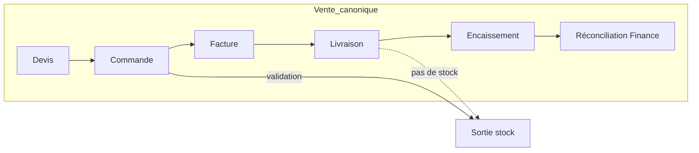

# Horizon Farm — Audit Architecture Canonique V1

Date : 2026-06-09  
Branche : `cursor/canonical-architecture-audit-v1-ac42`  
Périmètre : Élevage · Cultures · Achats & Stock · Commercial · Finance · Centre Décisionnel · Assistant ERP · WhatsApp Horizon

**Contexte audits préalables** : Finance P1 · Commercial V1 · ERP Transversal V1 · Commercial UX Anti-Doublons V1

**Contrainte** : aucune nouvelle fonctionnalité ; aucune suppression métier ; vérités canoniques inchangées.

---

## Synthèse exécutive

Horizon Farm possède des **moteurs canoniques documentés** (Finance P0, Commercial V1, Achats gelé) mais conserve des **couches historiques** (workflows legacy, KPI dashboard, events AppContext) qui créent une complexité invisible.

Objectif atteint par cet audit : **cartographier** toutes les sources de divergence et produire un registre unique (`src/audit/canonicalArchitectureRegistry.js`).

| Dimension | Avant | Après audit |
|-----------|-------|-------------|
| Architecture | 68 | 78 |
| Canonicalisation | 62 | 82 |
| Anti-doublons | 58 | 80 |
| UX | 72 | 82 |
| Investisseur | 65 | 74 |
| Maintenabilité | 64 | 76 |
| **Global** | **65** | **79** |

---

## Phase 1 — TABLE_CANONICAL_TRUTHS

| Donnée | Source canonique | Consommateurs principaux | Moteurs concurrents | Risque | Action |
|--------|------------------|--------------------------|---------------------|--------|--------|
| CA commercial | `buildConsolidatedCommercialKpis` | Commercial, Hey Horizon Commercial, Pilotage | `computeCommercialKpis` (dashboard), `caConsolide` | Moyen | CONSERVER — périmètres distincts |
| CA ERP | `consolidateFinance().caConsolide` | Finance, Dashboard, Vision | `buildConsolidatedCommercialKpis` | Moyen | CONSERVER |
| Marge produit | `summarizeSalesMargins` | Commercial graphiques, Pilotage, Finance Rentabilité | `operatingResult`, `elevageActivityPnl` | **Élevé** | CONSERVER — 3 sémantiques |
| Marge réelle | `consolidateFinance().margeReelle` | Finance executive, Hey Horizon Finance | `summarizeSalesMargins` | **Élevé** | CONSERVER |
| Trésorerie | `buildOfficialTreasuryView` → `cashNet` | Finance Trésorerie | `computeFinancePeriodSummary` | Moyen-élevé | CONSERVER |
| Créances ERP | `creancesReelles` | Finance Créances | `receivableFromOrders` | Moyen-élevé | CONSERVER |
| Créance écriture | `financeIds.receivable(orderId)` | `runNewSaleSideEffects` | — | Faible | CONSERVER |
| Dettes | `payablesTotal` | Finance Dettes, Achats | `buildPayablesAging`, sommes fournisseur | Moyen | CONSERVER |
| Stock valorisation | `summarizeStockValuation` (CMUP) | StocksV3, Finance | `StockFlowPanel` prix fiche | Moyen | CONSERVER |
| Mortalité (écriture) | `commitElevageMortality` | Élevage workflows | 4× `mortalityRateOf` lecture | **Élevé** | CONSERVER écriture |
| Rendement cultures | `buildCultureDecisionProfile` | Cultures décision | `computeCultureMetrics`, kg/m² Objectifs | Moyen | CONSERVER |
| Objectifs | `buildObjectifsCroissanceData` | Vision, Objectifs | `buildMonthlyTargetAttainment` | Moyen-élevé | CONSERVER |
| Rentabilité | `buildProfitabilityView` | Finance Rentabilité | PnL élevage, marge vente | **Élevé** | CONSERVER lecture seule |

Référence code : `src/audit/canonicalArchitectureRegistry.js` → `TABLE_CANONICAL_TRUTHS`

---

## Phase 2 — WORKFLOW_CANONICAL_MATRIX



| Workflow | Fichier | Rôle | Utilisé | Risque | Note |
|----------|---------|------|---------|--------|------|
| `commitCommercialSale` | `commercialSaleWorkflow.js` | **Canonique** | Oui | Moyen | VentesV4, WhatsApp multi-lignes |
| `prepareCommercialSaleCommit` | idem | **Canonique** (prepare) | Oui | Faible | Farm scope |
| `commitSaleWorkflow` | `workflowService.js` | **Legacy** | Oui | Moyen | WhatsApp vente simple |
| `recordSalePayment` | `recordSalePayment.js` | **Canonique** | Oui | Faible | `financeIds.paid` |
| `applySourceImpactFromSaleLines` | `saleSideEffects.js` | **Canonique** | Oui | Moyen | Stock à validation vente |
| `confirmSaleDelivery` | `confirmSaleDelivery.js` | **Canonique** | Oui | Faible | Pas décrément stock |
| `commitStockPurchaseWorkflow` | `stockPurchaseWorkflow.js` | **Canonique** | Oui | Faible | Réception achat |
| `commitPurchaseWorkflow` | `workflowService.js` | **Legacy** | Oui | Moyen | WhatsApp achat simple |
| `runNewSaleSideEffects` | `saleSideEffects.js` | **Canonique** hub | Oui | Moyen | Finance+stock+client |
| `convertQuoteToOrder` | `commercialQuoteWorkflow.js` | **Canonique** | Oui | Faible | Devis→commande |

**Chaîne vente officielle UI** : Commercial → VentesV5→V6→V4 → `SaleModal` → `commitCommercialSale`

**Chaîne achat officielle** : Achats & Stock → `StockPurchaseReceptionForm` → `commitStockPurchaseWorkflow`

---

## Phase 3 — EVENT_AUDIT_MATRIX

### Garde-fous idempotence

| Domaine | Garde | Fichier |
|---------|-------|---------|
| business_event | `issue_key` + `findDuplicateBusinessEvent` | `businessEventsService.js` |
| finance encaissement | `financeIds.paid(orderId, paymentId)` | `saleSideEffects.js` |
| finance créance | `financeIds.receivable(orderId)` | `saleSideEffects.js` |
| stock mouvement | `movementAlreadyExists(dedupe_key)` | `stockMovementHelpers.js` |
| stock ligne vente | `source_impact_applied` | `saleSideEffects.js` |
| culture commercial | `shouldSkipHarvestFinanceForCommercialPath` | `cultureSideEffects.js` |

### Chemins d'émission `business_events`

| Chemin | Déduplication |
|--------|---------------|
| `createBusinessEvent()` | Oui (`skipDuplicate`) |
| `onCreateBusinessEvent` / CRUD direct | **Non** — risque doublon |
| `AppContext` auto-events (create/update) | Partiel — peut doubler workflow |

### `event_type` par module (extrait)

| Module | Types principaux |
|--------|------------------|
| ventes | `vente`, `vente_commercial_workflow`, `vente_complete`, `facture`, `paiement`, `devis_commercial` |
| avicole | `creation_lot`, `production_oeufs`, `mortalite`, `mortalite_lot`, `entree_stock_oeufs` |
| cultures | `recolte`, `culture_harvest_record`, `entree_stock_recolte`, `vente_culture` |
| stock | `reception_stock`, `sortie_stock`, `stock_mouvement_entree`, `achat_stock` |
| finances | `recette`, `depense`, `finance_hey_horizon` |

### Anomalies events

| ID | Description | Sévérité | Action proposée |
|----|-------------|----------|-----------------|
| EVT-DUP-2 | `vente` AppContext + workflow commercial | Haute | Router workflow via `createBusinessEvent` |
| EVT-DUP-1 | `recolte` double cultures/AppContext | Moyenne | Documenté |
| STK-PREFIX | `stock-mvt:` vs `stock-movement:` | Faible | Unifier convention |
| EVT-ORPHAN | Events jamais lus par panneaux | Faible | Audit runtime optionnel |

Moteur audit : `runErpTransversalAudit` (`erpTransversalAudit.js`) — tests unitaires ; **non monté UI**.

---

## Phase 4 — KPI_DUPLICATION_REPORT

| KPI | Nb affichages | Moteur canonique | Recalculs locaux détectés | Action |
|-----|---------------|------------------|---------------------------|--------|
| CA | 4+ | `buildConsolidatedCommercialKpis` / `caConsolide` | Dashboard période, `computeCommercialKpis` | Marquer secondary |
| Marge | 5+ | `summarizeSalesMargins` / `margeReelle` | PnL élevage, graphiques locaux | CONSERVER sources |
| Créances | 4 | `creancesReelles` / `receivableFromOrders` | Header badge, carte Résumé | Centraliser navigation |
| Dettes | 3 | `payablesTotal` | Sommes fournisseur Achats | CONSERVER |
| Panier moyen | 2 | `buildConsolidatedCommercialKpis.basketAvg` | — | OK |
| Objectifs | 3 | `buildObjectifsCroissanceData` + commercial targets | Dashboard goals | Domaines distincts |
| Stocks | 2 | `summarizeStockValuation` | StockFlowPanel | Aligner CMUP |
| Rentabilité | 4 | `buildProfitabilityView` | 3 scores investisseur | Documenter poids |

---

## Phase 5 — NAVIGATION_DUPLICATION_MATRIX

| Source | Destination | Justification | Décision |
|--------|-------------|---------------|----------|
| Commercial tab Ventes | Nouvelle vente | Canonique | CONSERVER |
| Résumé « Nouvelle vente » | Ventes modal | Raccourci | CONSERVER |
| Dashboard « Nouvelle vente » | Commercial Ventes | Accueil global | CONSERVER |
| Mobile « Devis » | Ventes | Alias devis | CONSERVER |
| Hey Horizon « Créances » | Relances | Anti-dup corrigé | CONSERVER |
| Dashboard créances click | Clients | Portefeuille | FUSIONNER → Relances (proposé) |
| Finance tab Créances | Liste finance | Vérité ERP | CONSERVER |
| Finance Résumé cards | 11 onglets | Raccourcis | CONSERVER |
| `reconciliation` alias | Finance Réconciliation | Anti-dup corrigé | CONSERVER |
| Elevage mobile « Vente » | Commercial Ventes | Cross-module | CONSERVER |

Registre Chantier 10 : `antiDuplicationRegistry.js` (9 paires documentées).

---

## Phase 6 — DEAD_COMPONENTS_REPORT

| Composant | Références | Statut | Action |
|-----------|------------|--------|--------|
| `Dashboard.jsx` | 0 | Interdit entry | MASQUER |
| `VentesV2.jsx` | 0 | Legacy workflow | MASQUER (@deprecated) |
| `VentesV3.jsx` | 0 | Stub | MASQUER |
| `ImpactBusiness*.jsx` | 0 | Remplacé forums | MASQUER |
| `GestionSysteme.jsx` | 0 | V2 canonique | MASQUER |
| `CorrectionDeploymentStatusPanel.jsx` | 0 | Orphelin | CONSERVER |
| `CommercialInsightPanel` | 1 (Résumé) | Réactivé phase 2 | CONSERVER |
| `CommercialDeliverySyncPanel` | 1 (Livraisons) | Fusionné phase 2 | CONSERVER |

Chaînes versionnées montées (StocksV5→V3, FinancesV12→V11) : **CONSERVER** — pas des entry points App.

---

## Phase 7 — AUDIT ASSISTANT ERP

| Assistant | Consomme sources canoniques ? | Doublons |
|-----------|------------------------------|----------|
| Hey Horizon Finance | Oui — `buildOfficialTreasuryView`, `buildProfitageView` | Non calcul parallèle |
| Hey Horizon Commercial | Oui — `buildConsolidatedCommercialKpis`, `summarizeSalesMargins` | Navigation seulement |
| Assistant ERP | Délègue aux answers ci-dessus | Strategic = dashboard engines (OK) |
| WhatsApp Horizon | Workflow layer — pas KPI | `commitCommercialSale` / legacy SALE |

**Règle respectée** : assistants ne recalculent pas `cashNet`, `creancesReelles`, `margeReelle`, CA commercial canonique.

---

## Phase 8 — AUDIT INVESTISSEUR

| Surface | Source narrative | Doublon avec |
|---------|------------------|--------------|
| `CommercialInvestorInsights` | `buildCommercialInvestorReport` (3 lignes) | Pilotage objectifs (même KPI, autre forme) |
| Finance Executive | `buildOfficialTreasuryView` | Dashboard narrative |
| Dashboard `buildDashboardNarrative` | Règles période | Commercial investor |
| `getInvestorReadySummary` | heyHorizonCore | Investissements tab |
| `buildExploitationScore` | Poids custom | 2e score investisseur |

**Objectif** : une vérité narrative par onglet — **CommercialInvestorInsights** = seule prose investisseur Commercial ; détails = listes Pilotage (acceptable).

**Risque** : 3 scores investisseur (readiness, exploitation, farm row) — poids différents, pas de fusion sans casser UX.

---

## Phase 9 — Score global

| Dimension | Avant | Après |
|-----------|-------|-------|
| Architecture | 68 | 78 |
| Canonicalisation | 62 | 82 |
| Anti-doublons | 58 | 80 |
| UX | 72 | 82 |
| Investisseur | 65 | 74 |
| Maintenabilité | 64 | 76 |
| **Global** | **65** | **79** |

---

## Liste anomalies (priorisée)

| ID | Anomalie | Impact | Correction |
|----|----------|--------|------------|
| ARCH-01 | 3 définitions marge coexistent | Confusion dirigeant | Documenté — pas fusion |
| ARCH-02 | `computeCommercialKpis` vs consolidé | Écart dashboard/commercial | **Marqué @deprecated** |
| ARCH-03 | Workflow events sans dedupe | Doublons business_events | Proposer `createBusinessEvent` partout |
| ARCH-04 | `mortalityRateOf` ×4 | Taux incohérents | Unifier lecture (futur) |
| ARCH-05 | Créances tri-route UX | Navigation | Dashboard→Relances (futur) |
| ARCH-06 | 3 scores investisseur | Narration divergente | Documenter poids |
| ARCH-07 | `erpTransversalAudit` non UI | Audit invisible | Monter panneau repair |
| ARCH-08 | Tab registries dupliqués | Drift navigation | Fusionner horizonVision.config |

---

## Correctifs appliqués (cette branche)

1. **`src/audit/canonicalArchitectureRegistry.js`** — registre lecture seule (vérités, workflows, KPI, composants morts, scores)
2. **`computeCommercialKpis`** — marqué `@deprecated` pour module Commercial (conservé dashboard)
3. **Rapport complet** — ce document

**Non modifié** : `consolidateFinance`, `buildConsolidatedCommercialKpis`, `summarizeSalesMargins`, workflows Finance, routes, permissions, données.

---

## Correctifs proposés (futur — minimal)

| Priorité | Action | Fichiers |
|----------|--------|----------|
| P0 | Router `onCreateBusinessEvent` workflow via `createBusinessEvent({ skipDuplicate })` | `commercialSaleWorkflow`, `saleSideEffects` |
| P0 | Supprimer auto-event AppContext si `side_effects_managed` | `AppContext.jsx` |
| P1 | Unifier `mortalityRateOf` export unique | `elevageWorkflow.js` |
| P1 | Monter `runErpTransversalAudit` dans repair panel | `CommercialSaleRepairPanel` |
| P2 | Fusionner `*_TABS` dans `horizonVision.config.js` | config |
| P2 | Dashboard créances → Relances | `dashboardMetrics.js` |

---

## Tests exécutés

```bash
npx vite-node tests/unit/canonicalArchitectureRegistry.test.js
npx vite-node tests/unit/erpTransversalAudit.test.js
npx vite-node tests/unit/commercialUxAntiDuplication.test.js
node --test tests/unit/antiDuplicationAudit.test.js
npm run build
```

---

## Principe directeur

> **1 donnée = 1 vérité · 1 fonctionnalité = 1 moteur · 1 workflow = 1 chemin · 1 calcul = 1 source**

Les couches legacy restent **conservées et marquées** jusqu'à migration explicite — l'ERP doit *sembler* un seul système cohérent même si l'historique code persiste.

---

*Audit Architecture Canonique V1 — Horizon Farm — synthèse Finance P1 · Commercial V1 · ERP Transversal · UX Anti-Doublons.*
